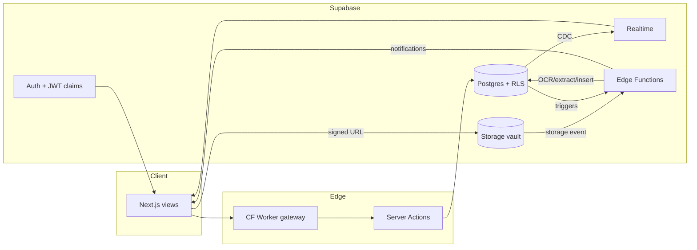
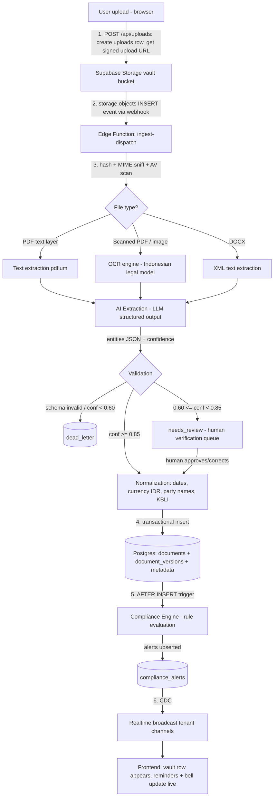

# Corplex Backend Architecture — Single Source of Truth

**Platform:** Corplex — Enterprise B2B Multi-Tenant Legal Operations Platform
**Organization:** MRWP Law Firm
**Document status:** Authoritative. Backend engineers implement from this document without further questions.
**Stack:** Next.js App Router (Cloudflare Pages) + Cloudflare Workers + Supabase (Postgres, pgvector, Storage, Realtime, Edge Functions, Auth) + RAG AI pipeline.

---

## 1. Executive Overview

### 1.1 Purpose

Corplex lets corporate clients of MRWP Law Firm run their entire legal operation from one tenant-isolated workspace: compliance scoring, employees and employment-law lifecycle (PKWT/PKWTT, SP warnings, mass compensation), contracts and agreements, licensing/permits, corporate secretarial governance (RUPS, circulars, statutory deadlines), assets and IP, litigation case management with evidentiary chain of custody, insurance policies and claims, tax obligations, an AI legal assistant, an AI legal drafter with clause-level risk analysis, legal tools (OCR, PDF ops, summarizer, translator, clause extraction, comparison, due diligence), and a lawyer consultation queue with quota-bounded verified legal reports.

The backend serves exactly the thirteen product modules that exist in the frontend (`components/views/`): Ringkasan (dashboard), Assistant, Drafter, Employment, Licensing, Corpsec, Asset & IP, Case, Tools, Agreement, Asuransi (insurance), Pajak (tax), and Lawyer (consultation queue). No speculative modules are designed; every table and API below maps to an existing view.

### 1.2 Architecture philosophy

1. **Database is the product.** Postgres owns all invariants: tenant isolation (RLS), quotas (advisory locks), state machines (CHECK constraints + triggers), audit immutability (revoked UPDATE/DELETE). Application layers are replaceable; the schema is not.
   *Rationale: multi-tenant legal data cannot depend on application code being bug-free; DB-enforced invariants survive every client. Trade-off: more PL/pgSQL to maintain.*
2. **Event-driven, not poll-driven.** Uploads, deadline ladders, compliance alerts, and queue changes propagate through Storage events, DB triggers, `pg_cron`, and Realtime broadcasts.
   *Rationale: the frontend is built around live reminders ("FUNGSI JAGA") and a live queue; polling would miss SLA windows and waste edge compute. Trade-off: harder-to-trace causality, mitigated by correlation IDs in `activity_logs`.*
3. **Zero hallucination.** The AI layer is retrieval-grounded against `legal_knowledge`/`embeddings` only; anything outside corpus scope returns a deterministic refusal. Every AI output is labeled `DRAF AI` until an MRWP advocate verifies it (AI -> LAWYER -> CLIENT chain).
   *Rationale: fabricated legal advice is an existential liability for a law firm. Trade-off: the AI refuses more often; that is the intended behavior.*
4. **Edge-first read path, region-pinned write path.** Cloudflare serves static/ISR content globally; all writes land in a single Supabase region (ap-southeast-1, Singapore — closest to Indonesian clients).
   *Rationale: legal data residency and strong consistency beat multi-master complexity at this scale. Trade-off: write latency for non-SEA users; acceptable for an Indonesian client base.*
5. **Least privilege by construction.** Browser code only ever holds the `anon` key + user JWT. `service_role` exists solely inside Workers/Edge Functions and the `/adminmrwp` server runtime. It never appears in any bundle shipped to a browser.

### 1.3 Design principles

- Single writer of truth per fact (e.g., quota counters live in one row, guarded by one lock).
- Soft delete everywhere user data lives (`deleted_at`); hard delete only via retention jobs.
- Every table carries `tenant_id` (except global tables), `created_at`, `updated_at`.
- Optimistic concurrency via `version int` columns on mutable business entities.
- Idempotency keys on every mutating API.
- Deterministic AI: temperature 0, pinned model versions, cached retrievals, seeded ranking.
- Everything observable: audit log, activity log, AI log, metrics, traces.

### 1.4 High-level system flow

```
 Browser (Next.js App Router, anon key + user JWT)
    |
    v
 Cloudflare Pages (static + SSR functions) --- Cloudflare Workers (API gateway,
    |                                            rate limit, WAF, cache)
    v                                                 |
 Supabase Auth  <--- JWT with tenant_id/role claims   |
    |                                                 v
 PostgREST / Server Actions ----------------> Postgres (RLS on every table)
    |                                                 |
 Supabase Storage --(storage event)--> Edge Functions (OCR, extraction,
    |                                   compliance engine, notifications)
    v                                                 |
 Supabase Realtime <---- triggers/broadcast ----------+
    |
    v
 Frontend live updates (queue, bell, reminders, verification feed)
```

### 1.5 Non-functional requirements

| Category | Goal | Measurement |
|---|---|---|
| Performance | p95 API read < 300 ms from Jakarta; p95 write < 600 ms; dashboard TTFB < 800 ms | Cloudflare analytics + pg_stat_statements |
| Availability | 99.9% monthly for API and Auth; 99.5% for AI pipeline (degrades gracefully to "DRAF AI unavailable") | Uptime probes + SLO burn alerts |
| Security | Zero cross-tenant reads (RLS-proven), all secrets in env vaults, immutable audit trail, OWASP ASVS L2 | Quarterly pen test + automated RLS test suite |
| Scalability | 1,000 tenants / 50k users / 5M documents without re-architecture | Load tests at 10x current traffic |
| Maintainability | Every migration reversible; schema changes via versioned migrations only; no manual prod SQL | CI migration gate |
| Observability | Every request traceable end-to-end via `request_id`; every AI answer reconstructible from logged retrieval set | Log completeness audits |
| Durability | RPO <= 5 min (WAL/PITR), RTO <= 1 h | Quarterly restore drills |

---

## 2. Global Infrastructure Architecture

### 2.1 Component roles

- **Cloudflare Pages** hosts the Next.js App Router build. Static assets and ISR pages are served from Cloudflare's global CDN; server-rendered routes run as Pages Functions (Workers runtime) at the edge.
  *Rationale: the dashboard shell is identical across tenants and caches perfectly; only data is dynamic. Trade-off: Node APIs unavailable in Workers runtime — all server code must be edge-compatible (`export const runtime = "edge"`).*
- **Cloudflare Workers** form the API gateway in front of Supabase: request validation, rate limiting (Durable Objects / KV counters), WAF rules, bot mitigation (Turnstile verification), response caching for public endpoints (e.g., `GET /verify/:hash` public document verification), and header hygiene (strip/inject).
- **Next.js App Router** provides Server Actions for authenticated mutations and Route Handlers for REST. All server code talks to Supabase with the caller's JWT (never service role), except the `/adminmrwp` runtime and webhook handlers.
- **Supabase Postgres** (single primary, ap-southeast-1) is the system of record. Extensions: `pgcrypto`, `pg_cron`, `pgvector`, `pg_net` (outbound HTTP from triggers), `pgjwt`.
- **Supabase Storage** holds the document vault (S3-compatible, private buckets, signed URLs only).
- **Supabase Realtime** streams Postgres changes (queue, alerts, notifications, report status) and broadcast channels (pipeline progress).
- **Supabase Edge Functions** (Deno) run the AI ingestion pipeline, compliance engine steps, notification fan-out, and webhook receivers — anything needing `service_role` or long-running (up to 400s) compute.
- **pgvector** stores embeddings for the legal knowledge base and tenant document chunks (RAG).

### 2.2 CDN, edge cache, regional routing

- Static assets: immutable, content-hashed, `Cache-Control: public, max-age=31536000, immutable`.
- SSR/API responses: `private, no-store` by default. Public verification endpoint (`/verify/:code`) is cached 60s at edge with `stale-while-revalidate` — it exposes only hash-match status, never document content.
- Regional routing: Cloudflare Argo smart routing from any POP to the Supabase Singapore origin. No multi-region database (see 21 and 25 for the roadmap).
- Cloudflare Tiered Cache reduces origin fetches for shared assets.

### 2.3 API gateway and rate limiting

All `/api/*` traffic passes through a Worker that enforces, in order:
1. TLS + HSTS (Cloudflare-managed).
2. WAF managed rules + custom rules (block known scanners, geo policies if mandated).
3. Turnstile token check on unauthenticated endpoints (login, public verify).
4. Rate limits (KV/Durable Object sliding window):
   - anonymous: 30 req/min/IP
   - authenticated: 300 req/min/user, 1,000 req/min/tenant
   - AI endpoints: 10 req/min/user (cost control)
   - login attempts: 5/min/IP + 20/hour/account (brute-force protection)
5. Request-size cap 10 MB (uploads go direct-to-Storage via signed URL, not through the gateway).
6. Injects `x-request-id` (UUID) propagated to Postgres via `SET LOCAL app.request_id` for end-to-end tracing.

*Rationale: rate limiting at the edge is free capacity protection before requests ever touch Postgres. Trade-off: two places to configure limits (edge + DB statement timeouts); documented in 16.*

### 2.4 Connection flow

- Browser -> PostgREST (`https://<proj>.supabase.co/rest/v1`) with anon key + user JWT for straightforward reads guarded by RLS.
- Browser -> Next.js Server Actions -> Supabase JS (user JWT) for mutations needing orchestration.
- Workers/Edge Functions -> Supabase via **Supavisor transaction-mode pooler** (port 6543) because edge runtimes cannot hold long-lived connections.
  *Rationale: serverless concurrency would exhaust Postgres's direct connection slots; transaction pooling multiplexes thousands of edge invocations onto ~40 real connections. Trade-off: no session-level state (prepared statements, `SET` without `LOCAL`) — all code must use `SET LOCAL` inside transactions.*
- Edge Functions performing privileged work use `service_role` over the pooler; the key lives only in Supabase secrets / Worker env bindings.

### 2.5 Deployment flow, CI/CD, environment separation

Three fully separated stacks; no shared resources:

| Env | Cloudflare | Supabase project | Branch | Data |
|---|---|---|---|---|
| Development | local `wrangler dev` / `next dev` | `supabase start` (local Docker) or dev project | feature branches | seeded fixtures |
| Staging | Pages preview + staging Worker | dedicated staging project (or Supabase branch) | `develop` | anonymized subset |
| Production | Pages production + prod Worker | production project | `main` | live |

Pipeline (GitHub Actions, detailed in section 23): lint -> typecheck -> unit -> `supabase db diff` gate -> integration tests against ephemeral DB -> preview deploy -> E2E -> manual approval -> migrate prod (expand/contract) -> deploy Pages/Workers/Edge Functions -> smoke tests. Secrets flow: GitHub OIDC -> Cloudflare/Supabase; no long-lived deploy keys in CI.

---

## 3. Complete System Architecture

Each module lists: owning tables, APIs, events, and the frontend view it serves.

### 3.1 Authentication module
Serves: login screen (`ACCOUNTS` in `lib/data.ts` today), session bootstrap in `store.tsx` (`login()`/`logout()`).
- Supabase Auth (email+password now; SSO later, section 25). Custom Access Token Hook stamps `tenant_id`, `role`, `plan` into JWT claims.
- Tables: `users`, `sessions`, `invitations`, `roles`, `permissions`, `role_permissions`.
- On login the client receives a JWT whose `tenant_id` claim scopes every subsequent query — this is the backend realization of the frontend toast "token terikat tenant_id".

### 3.2 Dashboard module (Ringkasan)
Serves: `Ringkasan.tsx` — compliance score + delta, KPI cards (docs count, permits, quota used/max, verified count), per-chapter breakdown (`bab`), reminder list (`rem`), bell notifications (`bell`), verification feed (`verif`).
- Read-mostly aggregation over `documents`, `contracts`, `compliance_alerts`, `legal_reports`, `notifications`.
- Materialized per-tenant KPI row `tenant_kpis` refreshed by triggers + nightly cron (section 20). Compliance score = weighted function of open alerts, overdue deadlines, unverified legally-binding documents; formula versioned in `system_settings`.

### 3.3 Employees module (Employment)
Serves: `Employment.tsx` — employee roster (PKWT/PKWTT, TKI/TKA, contract end dates, `sisa`/remaining months), SP warning letters (`sp` records with expiry), mass PKWT compensation recap (`mass`), reminder chips.
- Tables: `employees` (+ `employee_warnings` child table for SP1/SP2/SP3), `documents` (employment contracts linked via `documents.employee_id`).
- Compliance engine rules: PKWT ending (deadline ladder), SP expiry, RPTKA expiry for TKA, duplicate employee detection (section 9).
- Mass compensation recap = SQL view computing statutory PKWT compensation from salary and tenure.

### 3.4 Legal Reports module (Lawyer)
Serves: `Lawyer.tsx` — consultation queue (`QItem`: title, meta, risk chip, SLA, status masuk/verified/rejected), quota bar (used/max), verified counter; also the `pushQueue` flow from Drafter/Assistant escalations.
- Tables: `legal_reports` (the queue items + verified opinions), `report_history` (every status transition), quota columns on `tenants`.
- Status pipeline and transaction-safe quota in section 13. Realtime channel per tenant pushes queue changes.

### 3.5 Compliance module (FUNGSI JAGA)
Serves: reminder rows in Ringkasan (`rem`), bell dropdown (`bell`), per-module deadline chips (Licensing "14 HARI", Agreement "59 HARI", Pajak "10 HARI", etc.).
- Tables: `compliance_alerts` (one row per active obligation instance), rule definitions in `system_settings` + code.
- Deadline ladder H-90 -> H-60 -> H-30 -> H-14 (plus module-specific rungs like H-7/H-1 for hearings): each rung escalates severity and re-notifies. Engine in section 9.

### 3.6 Documents module (Drafter + vault)
Serves: `Drafter.tsx` — document list with status (DRAF / DRAF AI / VERIFIED), version history (`vers`), risk score, red flags with suggested replacement clauses (`flags`/`fix`), body preview; export lock "403 VERIFIKASI_WAJIB" for unverified legally-binding docs.
- Tables: `documents`, `document_versions`, `document_flags`, `uploads`.
- Every stored version carries a SHA-256 hash; advocate verification signs the hash of the final version (AI -> LAWYER -> CLIENT chain, section 5.8). Public QR verification endpoint checks hash match without exposing content (Tools "Keabsahan Dokumen").

### 3.7 Storage module
Section 17. Buckets: `vault` (tenant documents), `evidence` (case exhibits, WORM-style), `kb` (firm knowledge base sources), `tmp` (tool inputs/outputs, 24h TTL).

### 3.8 Notifications module
Serves: bell dropdown, toasts triggered by backend events, email digests. Tables: `notifications` (+ `notification_deliveries`). Architecture in section 14.

### 3.9 Lawyers module
Serves: MRWP-side workflow (verify/reject queue items, sign documents). Lawyers are `users` with role `lawyer`, cross-tenant read access scoped to assigned reports (RLS in section 6). SLA computation: `sla_due_at = created_at + plan_sla_interval` (BASIC 48h, BUSINESS 24h, ENTERPRISE 12h — matches frontend SLA chips).

### 3.10 AI module (Assistant + Drafter engine + Tools)
Serves: `Assistant.tsx` (conversations with cited answers, `RUJUKAN ✓ SUMBER RESMI` source chips, escalation messages), Drafter risk analysis, `Tools.tsx` (summarizer, translator, clause extraction, comparison, due diligence scanner).
- Tables: `ai_conversations`, `ai_messages`, `ai_runs` (log of every model call: prompt hash, retrieval set, confidence, cost).
- RAG pipeline in sections 10-12; ingestion pipeline in section 8.

### 3.11 Knowledge Base module
Tables: `knowledge_base` (firm-curated corpus registry: regulations, clause library, glossary), `legal_knowledge` (normalized legal norms/articles with jurisdiction + source priority), `embeddings` (pgvector chunks). Section 11.

### 3.12 Settings module
Tables: `system_settings` (global + per-tenant overrides), `feature_flags`. Only `owner`/`admin` roles mutate tenant settings; only super admin mutates global.

### 3.13 Admin module
`/adminmrwp` secret dashboard, section 7.

### 3.14 Realtime module
Section 15. Channels: `tenant:{id}:queue`, `tenant:{id}:alerts`, `tenant:{id}:notifications`, `tenant:{id}:pipeline`, plus `admin:global` (service-role only).

### 3.15 Audit & Monitoring modules
Sections 18-19. `audit_logs` (immutable, security-relevant), `activity_logs` (high-volume behavioral).

### 3.16 Domain modules mapped 1:1 to remaining views

| View | Module | Owning tables (domain layer) |
|---|---|---|
| `Agreement.tsx` | Contracts registry (parties, dates, value, status AKTIF/SEGERA/DRAF) | `contracts` |
| `Licensing.tsx` | Permits (NIB, Sertifikat Standar, KBLI, expiry ladder, OSS tracking) | `licenses` |
| `Corpsec.tsx` | Governance (RUPS timeline, circular resolutions, directors' sign-offs, meetings, cap table, statutory deadlines) | `corp_actions`, `corp_officers`, `cap_table_entries` |
| `Asset.tsx` | Assets & IP (encumbrances HAK TANGGUNGAN/FIDUSIA, HKI marks/designs/copyright, watcher indications) | `assets`, `ip_rights` |
| `CaseView.tsx` | Litigation (timeline, evidence with hash + chain of custody, costs, escalate-somasi-to-lawsuit action) | `cases`, `case_events`, `case_evidence`, `case_costs` |
| `Asuransi.tsx` | Insurance (policies linked to assets/agreements/employment, claims with timelines, coverage gaps) | `insurance_policies`, `insurance_claims` |
| `Pajak.tsx` | Tax (profile, obligation calendar, cross-module joins, sync integrations) | `tax_profiles`, `tax_obligations` |
| Global search (`idx`) | Cross-module index | Postgres FTS view `search_index` (section 16) |

These domain tables follow the identical column conventions as the mandated tables (tenant_id, soft delete, timestamps, versioning); representative DDL is given in 4.6.

### 3.17 Module interaction diagram



Key cross-module data flows (all evident in the frontend copy):
- Employment -> Pajak: headcount/payroll feed PPh 21 computation ("48 tenaga kerja tersinkron").
- Asset -> Pajak: asset registration spawns derived tax obligations (PBB, vehicle tax).
- Agreement -> Pajak: contract values feed PPN DPP reconciliation.
- Agreement/Asset/Employment -> Asuransi: policies link to insured objects; new contracts trigger coverage-gap detection.
- Drafter -> Lawyer: high-risk drafts enter the verification queue (`pushQueue`).
- Assistant -> Lawyer: legally-consequential questions escalate ("FUNGSI JAMIN", same-conversation escalation).
- Case -> Drafter: somasi drafted, then escalated to lawsuit carrying evidence bundle ("POST /case/dari-somasi").
- Licensing/Corpsec/all -> Compliance engine -> Ringkasan reminders + bell.

---

## 4. Supabase Relational Database Design

### 4.1 Conventions (apply to every table)

- Primary keys: `uuid DEFAULT gen_random_uuid()`. *Rationale: no sequence contention, safe to generate client-side for idempotency, no cross-tenant enumeration. Trade-off: 16-byte keys, mitigated by covering indexes.*
- Tenancy: every tenant-scoped table has `tenant_id uuid NOT NULL REFERENCES tenants(id) ON DELETE CASCADE` and a composite index led by `tenant_id`. *Cascade rationale: tenant deletion is a deliberate super-admin action (section 7); a soft-suspend always precedes any hard delete, and orphaned tenant rows are worse than cascading loss.*
- Timestamps: `created_at timestamptz NOT NULL DEFAULT now()`, `updated_at timestamptz NOT NULL DEFAULT now()` maintained by a shared trigger.
- Soft delete: `deleted_at timestamptz NULL`. RLS policies filter `deleted_at IS NULL` for non-admin roles. Hard deletes only via retention cron (section 17.5) or super admin.
- Versioning: mutable business entities carry `version int NOT NULL DEFAULT 1`; the `touch` trigger increments it, and optimistic writers send `WHERE version = $expected`.
- Nullable policy: columns are `NOT NULL` unless the domain genuinely allows absence (e.g., `employees.contract_end` is NULL for permanent PKWTT staff). Every nullable column is intentional.
- Naming: snake_case, FK columns `<entity>_id`, check constraints named `<table>_<col>_ck`.

Shared trigger and JWT claim helpers used by all RLS policies:

```sql
CREATE SCHEMA IF NOT EXISTS app;

CREATE OR REPLACE FUNCTION app.touch() RETURNS trigger
LANGUAGE plpgsql AS $$
BEGIN
  NEW.updated_at := now();
  IF to_jsonb(NEW) ? 'version' THEN NEW.version := OLD.version + 1; END IF;
  RETURN NEW;
END $$;
-- Attach to each table:
-- CREATE TRIGGER touch BEFORE UPDATE ON <table> FOR EACH ROW EXECUTE FUNCTION app.touch();

CREATE OR REPLACE FUNCTION app.tenant_id() RETURNS uuid
LANGUAGE sql STABLE AS $$
  SELECT NULLIF(current_setting('request.jwt.claims', true)::jsonb ->> 'tenant_id','')::uuid
$$;

CREATE OR REPLACE FUNCTION app.role() RETURNS text
LANGUAGE sql STABLE AS $$
  SELECT COALESCE(current_setting('request.jwt.claims', true)::jsonb ->> 'app_role','anon')
$$;

CREATE OR REPLACE FUNCTION app.uid() RETURNS uuid
LANGUAGE sql STABLE AS $$ SELECT auth.uid() $$;
```

### 4.2 Core tenancy and identity tables

```sql
-- ============================== tenants ==============================
CREATE TABLE tenants (
  id               uuid PRIMARY KEY DEFAULT gen_random_uuid(),
  name             text NOT NULL,                          -- "PT Contoh Sejahtera"
  slug             text NOT NULL UNIQUE,
  plan             text NOT NULL DEFAULT 'BASIC'
                     CONSTRAINT tenants_plan_ck CHECK (plan IN ('BASIC','BUSINESS','ENTERPRISE')),
  sector           text,                                   -- "Industri Pangan Olahan - Cirebon"
  avatar_initials  text,                                   -- "CS"
  status           text NOT NULL DEFAULT 'active'
                     CONSTRAINT tenants_status_ck CHECK (status IN ('active','suspended','pending_deletion')),
  compliance_score numeric(5,2) NOT NULL DEFAULT 0,        -- Ringkasan score (92 / 78 / 88)
  score_delta      numeric(5,2) NOT NULL DEFAULT 0,
  -- Lawyer report quota (section 13). Default hard cap 7; plans may override
  -- (frontend shows 4/10/25 per plan) via super-admin action only.
  report_quota_max  int NOT NULL DEFAULT 7 CHECK (report_quota_max >= 0),
  report_quota_used int NOT NULL DEFAULT 0 CHECK (report_quota_used >= 0),
  CONSTRAINT tenants_quota_ck CHECK (report_quota_used <= report_quota_max),
  settings         jsonb NOT NULL DEFAULT '{}'::jsonb,
  suspended_at     timestamptz,
  version          int NOT NULL DEFAULT 1,
  deleted_at       timestamptz,
  created_at       timestamptz NOT NULL DEFAULT now(),
  updated_at       timestamptz NOT NULL DEFAULT now()
);
CREATE INDEX tenants_status_idx ON tenants(status) WHERE deleted_at IS NULL;

-- ============================== roles ==============================
CREATE TABLE roles (
  id           uuid PRIMARY KEY DEFAULT gen_random_uuid(),
  key          text NOT NULL UNIQUE
                 CONSTRAINT roles_key_ck CHECK (key IN ('owner','admin','client','lawyer','super_admin')),
  description  text NOT NULL,
  is_firm_side boolean NOT NULL DEFAULT false,             -- lawyer, super_admin
  created_at   timestamptz NOT NULL DEFAULT now(),
  updated_at   timestamptz NOT NULL DEFAULT now()
);

-- ============================== permissions ==============================
CREATE TABLE permissions (
  id          uuid PRIMARY KEY DEFAULT gen_random_uuid(),
  key         text NOT NULL UNIQUE,     -- 'documents.read','documents.verify','reports.approve',...
  description text NOT NULL,
  created_at  timestamptz NOT NULL DEFAULT now(),
  updated_at  timestamptz NOT NULL DEFAULT now()
);

-- ============================== role_permissions ==============================
CREATE TABLE role_permissions (
  role_id       uuid NOT NULL REFERENCES roles(id) ON DELETE CASCADE,
  permission_id uuid NOT NULL REFERENCES permissions(id) ON DELETE CASCADE,
  created_at    timestamptz NOT NULL DEFAULT now(),
  PRIMARY KEY (role_id, permission_id)
);

-- ============================== users ==============================
-- Mirrors auth.users 1:1; app-facing profile + tenant membership + role.
CREATE TABLE users (
  id           uuid PRIMARY KEY REFERENCES auth.users(id) ON DELETE CASCADE,
  tenant_id    uuid REFERENCES tenants(id) ON DELETE CASCADE, -- NULL for firm-side (lawyer/super_admin)
  email        citext NOT NULL UNIQUE,
  full_name    text NOT NULL,
  title        text,                                          -- "Legal Admin", "Legal Counsel"
  role_id      uuid NOT NULL REFERENCES roles(id) ON DELETE RESTRICT,
  status       text NOT NULL DEFAULT 'active'
                 CONSTRAINT users_status_ck CHECK (status IN ('active','invited','disabled')),
  last_seen_at timestamptz,
  mfa_enrolled boolean NOT NULL DEFAULT false,
  version      int NOT NULL DEFAULT 1,
  deleted_at   timestamptz,
  created_at   timestamptz NOT NULL DEFAULT now(),
  updated_at   timestamptz NOT NULL DEFAULT now()
);
CREATE INDEX users_tenant_idx ON users(tenant_id, role_id) WHERE deleted_at IS NULL;

-- ============================== sessions ==============================
-- App-level session registry layered over Supabase Auth refresh sessions:
-- device metadata, revocation, concurrent-session limits, audit anchor.
CREATE TABLE sessions (
  id              uuid PRIMARY KEY DEFAULT gen_random_uuid(),
  user_id         uuid NOT NULL REFERENCES users(id) ON DELETE CASCADE,
  tenant_id       uuid REFERENCES tenants(id) ON DELETE CASCADE,
  auth_session_id uuid,                       -- supabase auth.sessions id
  ip              inet,
  user_agent      text,
  created_at      timestamptz NOT NULL DEFAULT now(),
  last_active_at  timestamptz NOT NULL DEFAULT now(),
  expires_at      timestamptz NOT NULL,
  revoked_at      timestamptz,
  revoke_reason   text
);
CREATE INDEX sessions_user_idx ON sessions(user_id, revoked_at);
CREATE INDEX sessions_expiry_idx ON sessions(expires_at) WHERE revoked_at IS NULL;

-- ============================== invitations ==============================
CREATE TABLE invitations (
  id          uuid PRIMARY KEY DEFAULT gen_random_uuid(),
  tenant_id   uuid NOT NULL REFERENCES tenants(id) ON DELETE CASCADE,
  email       citext NOT NULL,
  role_id     uuid NOT NULL REFERENCES roles(id) ON DELETE RESTRICT,
  invited_by  uuid REFERENCES users(id) ON DELETE SET NULL,
  token_hash  text NOT NULL,                  -- sha256 of single-use token; raw token only in email
  status      text NOT NULL DEFAULT 'pending'
                CONSTRAINT invitations_status_ck CHECK (status IN ('pending','accepted','expired','revoked')),
  expires_at  timestamptz NOT NULL DEFAULT now() + interval '7 days',
  accepted_at timestamptz,
  created_at  timestamptz NOT NULL DEFAULT now(),
  updated_at  timestamptz NOT NULL DEFAULT now()
);
CREATE UNIQUE INDEX invitations_pending_uq ON invitations(tenant_id, email) WHERE status = 'pending';
CREATE INDEX invitations_tenant_idx ON invitations(tenant_id, status);
```

*Roles rationale:* `owner` (tenant principal: billing, user management), `admin` (tenant legal admin: full module access), `client` (tenant member: read + submit), `lawyer` (MRWP advocate: cross-tenant but assignment-scoped), `super_admin` (MRWP platform staff: `/adminmrwp` only). A fixed enum rather than free-form roles because RLS policies reference role keys; custom roles would require dynamic policy generation. Finer capability checks within a role use the `permissions` lookup in API code, keeping RLS coarse and fast.

### 4.3 People and document tables

```sql
-- ============================== employees ==============================
CREATE TABLE employees (
  id             uuid PRIMARY KEY DEFAULT gen_random_uuid(),
  tenant_id      uuid NOT NULL REFERENCES tenants(id) ON DELETE CASCADE,
  full_name      text NOT NULL,
  job_title      text NOT NULL,                        -- "Supervisor Produksi"
  gender         text CONSTRAINT employees_gender_ck CHECK (gender IN ('L','P')),
  nationality    text NOT NULL DEFAULT 'TKI'
                   CONSTRAINT employees_nat_ck CHECK (nationality IN ('TKI','TKA')),
  onsite         boolean NOT NULL DEFAULT true,        -- "lok" flag in frontend
  contract_type  text NOT NULL
                   CONSTRAINT employees_ctype_ck CHECK (contract_type IN ('PKWT','PKWTT')),
  contract_start date,
  contract_end   date,                                 -- NULL for PKWTT
  CONSTRAINT employees_pkwt_end_ck CHECK (contract_type = 'PKWTT' OR contract_end IS NOT NULL),
  monthly_salary numeric(14,2),                        -- feeds mass compensation recap + PPh 21
  tenure_months  int,
  compliance_status text NOT NULL DEFAULT 'PATUH'
                   CONSTRAINT employees_comp_ck CHECK (compliance_status IN ('PATUH','REMINDER','PELANGGARAN')),
  contract_document_id uuid,                           -- FK to documents added post-creation (circular)
  is_active      boolean NOT NULL DEFAULT true,
  version        int NOT NULL DEFAULT 1,
  deleted_at     timestamptz,
  created_at     timestamptz NOT NULL DEFAULT now(),
  updated_at     timestamptz NOT NULL DEFAULT now()
);
CREATE INDEX employees_tenant_idx ON employees(tenant_id) WHERE deleted_at IS NULL;
CREATE INDEX employees_contract_end_idx ON employees(tenant_id, contract_end)
  WHERE deleted_at IS NULL AND contract_end IS NOT NULL;
-- Duplicate detection support (compliance rule, section 9):
CREATE INDEX employees_name_trgm_idx ON employees USING gin (lower(full_name) gin_trgm_ops);

-- SP warning-letter ladder (SP1/SP2/SP3 shown in Employment view)
CREATE TABLE employee_warnings (
  id          uuid PRIMARY KEY DEFAULT gen_random_uuid(),
  tenant_id   uuid NOT NULL REFERENCES tenants(id) ON DELETE CASCADE,
  employee_id uuid NOT NULL REFERENCES employees(id) ON DELETE CASCADE,
  level       text NOT NULL CHECK (level IN ('SP1','SP2','SP3')),
  issued_on   date NOT NULL,
  expires_on  date NOT NULL,
  reason      text NOT NULL,
  document_id uuid,                                    -- FK to documents added post-creation
  verified    boolean NOT NULL DEFAULT false,          -- advocate-verified
  deleted_at  timestamptz,
  created_at  timestamptz NOT NULL DEFAULT now(),
  updated_at  timestamptz NOT NULL DEFAULT now()
);
CREATE INDEX employee_warnings_emp_idx ON employee_warnings(tenant_id, employee_id, expires_on);

-- ============================== contracts ==============================
-- Structured registry behind the Agreement view (distinct from the file in documents).
CREATE TABLE contracts (
  id           uuid PRIMARY KEY DEFAULT gen_random_uuid(),
  tenant_id    uuid NOT NULL REFERENCES tenants(id) ON DELETE CASCADE,
  name         text NOT NULL,                          -- "Perjanjian Distribusi Produk"
  party_1      text NOT NULL,
  party_2      text NOT NULL,
  starts_on    date,
  ends_on      date,
  contract_value_text text,                            -- "Rp 2,4 M / tahun" (display verbatim)
  contract_value_idr  numeric(18,2),                   -- normalized for tax DPP joins
  status       text NOT NULL DEFAULT 'DRAFT'
                 CONSTRAINT contracts_status_ck
                 CHECK (status IN ('DRAFT','ACTIVE','EXPIRING','EXPIRED','TERMINATED')),
  document_id  uuid,                                   -- FK to documents added post-creation
  version      int NOT NULL DEFAULT 1,
  deleted_at   timestamptz,
  created_at   timestamptz NOT NULL DEFAULT now(),
  updated_at   timestamptz NOT NULL DEFAULT now()
);
CREATE INDEX contracts_tenant_ends_idx ON contracts(tenant_id, ends_on)
  WHERE deleted_at IS NULL AND status IN ('ACTIVE','EXPIRING');

-- ============================== documents ==============================
-- The vault: every legal file (drafts, contracts, evidence, permits, SPs).
CREATE TABLE documents (
  id              uuid PRIMARY KEY DEFAULT gen_random_uuid(),
  tenant_id       uuid NOT NULL REFERENCES tenants(id) ON DELETE CASCADE,
  title           text NOT NULL,                       -- "Perjanjian_Jasa_Vendor_Logistik.docx"
  doc_type        text NOT NULL DEFAULT 'general',     -- contract|nda|somasi|sp|permit|evidence|minutes|policy|other
  module          text NOT NULL DEFAULT 'drafter',     -- originating module (view id)
  status          text NOT NULL DEFAULT 'DRAFT'
                    CONSTRAINT documents_status_ck CHECK (status IN
                    ('DRAFT','AI_DRAFT','PENDING_VERIFICATION','VERIFIED','REJECTED','ARCHIVED')),
  legal_effect    boolean NOT NULL DEFAULT false,      -- true => export locked until VERIFIED (403 VERIFIKASI_WAJIB)
  current_version_id uuid,                             -- FK added after document_versions exists
  risk_score      int CHECK (risk_score BETWEEN 0 AND 100),
  ai_confidence   numeric(4,3),                        -- extraction confidence 0..1
  employee_id     uuid REFERENCES employees(id) ON DELETE SET NULL,
  contract_id     uuid REFERENCES contracts(id) ON DELETE SET NULL,
  verified_by     uuid REFERENCES users(id) ON DELETE SET NULL,   -- MRWP advocate
  verified_at     timestamptz,
  verification_signature text,                         -- advocate signature over final version hash
  public_verify_code text UNIQUE,                      -- QR verify code (GET /verify/:code)
  metadata        jsonb NOT NULL DEFAULT '{}'::jsonb,  -- extracted entities (parties, value, term...)
  version         int NOT NULL DEFAULT 1,
  deleted_at      timestamptz,
  created_at      timestamptz NOT NULL DEFAULT now(),
  updated_at      timestamptz NOT NULL DEFAULT now()
);
CREATE INDEX documents_tenant_status_idx ON documents(tenant_id, status) WHERE deleted_at IS NULL;
CREATE INDEX documents_tenant_module_idx ON documents(tenant_id, module) WHERE deleted_at IS NULL;
CREATE INDEX documents_metadata_gin ON documents USING gin (metadata jsonb_path_ops);

-- Resolve circular FKs now that documents exists:
ALTER TABLE employees ADD CONSTRAINT employees_contract_doc_fk
  FOREIGN KEY (contract_document_id) REFERENCES documents(id) ON DELETE SET NULL;
ALTER TABLE employee_warnings ADD CONSTRAINT employee_warnings_doc_fk
  FOREIGN KEY (document_id) REFERENCES documents(id) ON DELETE SET NULL;
ALTER TABLE contracts ADD CONSTRAINT contracts_doc_fk
  FOREIGN KEY (document_id) REFERENCES documents(id) ON DELETE SET NULL;

-- ============================== document_versions ==============================
-- Immutable version chain; one row per stored file version.
CREATE TABLE document_versions (
  id            uuid PRIMARY KEY DEFAULT gen_random_uuid(),
  tenant_id     uuid NOT NULL REFERENCES tenants(id) ON DELETE CASCADE,
  document_id   uuid NOT NULL REFERENCES documents(id) ON DELETE CASCADE,
  version_no    int NOT NULL,
  storage_path  text NOT NULL,                         -- vault/{tenant}/{doc}/v{n}.{ext}
  sha256        text NOT NULL,                         -- content hash: verification-chain anchor
  size_bytes    bigint NOT NULL CHECK (size_bytes >= 0),
  mime_type     text NOT NULL,
  created_by    uuid REFERENCES users(id) ON DELETE SET NULL,
  source        text NOT NULL DEFAULT 'upload'
                  CHECK (source IN ('upload','ai_draft','tool_output','correction')),
  created_at    timestamptz NOT NULL DEFAULT now(),
  UNIQUE (document_id, version_no)
);
CREATE INDEX document_versions_doc_idx ON document_versions(document_id, version_no DESC);
CREATE INDEX document_versions_sha_idx ON document_versions(tenant_id, sha256);
ALTER TABLE documents
  ADD CONSTRAINT documents_current_version_fk
  FOREIGN KEY (current_version_id) REFERENCES document_versions(id) ON DELETE SET NULL;
REVOKE UPDATE, DELETE ON document_versions FROM authenticated, anon;  -- versions are immutable

-- ============================== document_flags ==============================
-- Red flags found by AI clause analysis (Drafter view "flags")
CREATE TABLE document_flags (
  id            uuid PRIMARY KEY DEFAULT gen_random_uuid(),
  tenant_id     uuid NOT NULL REFERENCES tenants(id) ON DELETE CASCADE,
  document_id   uuid NOT NULL REFERENCES documents(id) ON DELETE CASCADE,
  version_id    uuid NOT NULL REFERENCES document_versions(id) ON DELETE CASCADE,
  severity      text NOT NULL DEFAULT 'red' CHECK (severity IN ('red','warn')),
  title         text NOT NULL,                         -- "Denda 5%/hari tanpa plafon"
  detail        text NOT NULL,
  weight        int NOT NULL DEFAULT 0,                -- contribution to risk score
  clause_anchor text,                                  -- highlight anchor id in rendered body
  suggested_fix_title text,
  suggested_fix_text  text,                            -- replacement clause from MRWP clause library
  resolved      boolean NOT NULL DEFAULT false,
  resolved_by   uuid REFERENCES users(id) ON DELETE SET NULL,
  created_at    timestamptz NOT NULL DEFAULT now(),
  updated_at    timestamptz NOT NULL DEFAULT now()
);
CREATE INDEX document_flags_doc_idx ON document_flags(tenant_id, document_id, resolved);

-- ============================== uploads ==============================
-- Every client upload attempt, independent of eventual document creation:
-- progress/cancel/retry support + AI-pipeline job state (section 8).
CREATE TABLE uploads (
  id             uuid PRIMARY KEY DEFAULT gen_random_uuid(),  -- client-generated: idempotency key
  tenant_id      uuid NOT NULL REFERENCES tenants(id) ON DELETE CASCADE,
  user_id        uuid REFERENCES users(id) ON DELETE SET NULL,
  original_name  text NOT NULL,
  mime_type      text NOT NULL,
  size_bytes     bigint NOT NULL CHECK (size_bytes BETWEEN 1 AND 104857600), -- 100 MB cap
  storage_path   text,
  sha256         text,
  status         text NOT NULL DEFAULT 'pending'
                   CONSTRAINT uploads_status_ck CHECK (status IN
                   ('pending','uploaded','scanning','processing','extracted','needs_review',
                    'completed','failed','dead_letter','cancelled')),
  pipeline_step  text,                                -- ocr|extract|validate|normalize|insert|compliance
  attempt_count  int NOT NULL DEFAULT 0,
  last_error     text,
  confidence     numeric(4,3),
  document_id    uuid REFERENCES documents(id) ON DELETE SET NULL,
  created_at     timestamptz NOT NULL DEFAULT now(),
  updated_at     timestamptz NOT NULL DEFAULT now()
);
CREATE INDEX uploads_tenant_status_idx ON uploads(tenant_id, status, created_at DESC);
CREATE INDEX uploads_dead_letter_idx ON uploads(status, updated_at) WHERE status = 'dead_letter';
```

### 4.4 Legal reports, compliance, notifications, logs

```sql
-- ============================== legal_reports ==============================
-- One row per lawyer-consultation item (the queue in the Lawyer view).
CREATE TABLE legal_reports (
  id              uuid PRIMARY KEY DEFAULT gen_random_uuid(),
  tenant_id       uuid NOT NULL REFERENCES tenants(id) ON DELETE CASCADE,
  requested_by    uuid REFERENCES users(id) ON DELETE SET NULL,
  assigned_lawyer uuid REFERENCES users(id) ON DELETE SET NULL,
  title           text NOT NULL,                       -- "Perjanjian Jasa - Vendor Logistik v3"
  summary         text,                                -- queue meta line
  origin          text NOT NULL DEFAULT 'manual'
                    CHECK (origin IN ('drafter','assistant','employment','case','manual')),
  risk_label      text,                                -- RISIKO TINGGI | ESKALASI | DRAF AI
  status          text NOT NULL DEFAULT 'DRAFT'
                    CONSTRAINT legal_reports_status_ck CHECK (status IN
                    ('DRAFT','PENDING','UNDER_REVIEW','NEEDS_REVISION','APPROVED','REJECTED','ADVICE_DELIVERED')),
  counts_against_quota boolean NOT NULL DEFAULT true,  -- rejected/cancelled items refunded (section 13)
  document_id     uuid REFERENCES documents(id) ON DELETE SET NULL,
  sla_due_at      timestamptz,                         -- submitted_at + plan SLA
  submitted_at    timestamptz,
  decided_at      timestamptz,
  decision_note   text,
  version         int NOT NULL DEFAULT 1,
  deleted_at      timestamptz,
  created_at      timestamptz NOT NULL DEFAULT now(),
  updated_at      timestamptz NOT NULL DEFAULT now()
);
CREATE INDEX legal_reports_tenant_status_idx ON legal_reports(tenant_id, status) WHERE deleted_at IS NULL;
CREATE INDEX legal_reports_lawyer_idx ON legal_reports(assigned_lawyer, status)
  WHERE deleted_at IS NULL AND assigned_lawyer IS NOT NULL;
CREATE INDEX legal_reports_sla_idx ON legal_reports(sla_due_at)
  WHERE status IN ('PENDING','UNDER_REVIEW');

-- ============================== report_history ==============================
-- Append-only status transition log (drives realtime timeline + audit).
CREATE TABLE report_history (
  id          uuid PRIMARY KEY DEFAULT gen_random_uuid(),
  tenant_id   uuid NOT NULL REFERENCES tenants(id) ON DELETE CASCADE,
  report_id   uuid NOT NULL REFERENCES legal_reports(id) ON DELETE CASCADE,
  from_status text,
  to_status   text NOT NULL,
  actor_id    uuid REFERENCES users(id) ON DELETE SET NULL,
  actor_role  text NOT NULL,
  note        text,
  created_at  timestamptz NOT NULL DEFAULT now()
);
CREATE INDEX report_history_report_idx ON report_history(report_id, created_at);
REVOKE UPDATE, DELETE ON report_history FROM authenticated, anon;   -- append-only

-- ============================== compliance_alerts ==============================
-- One row per live obligation (FUNGSI JAGA). Feeds Ringkasan "rem" + module chips.
CREATE TABLE compliance_alerts (
  id            uuid PRIMARY KEY DEFAULT gen_random_uuid(),
  tenant_id     uuid NOT NULL REFERENCES tenants(id) ON DELETE CASCADE,
  rule_key      text NOT NULL,     -- 'contract_expiry','pkwt_expiry','license_expiry','sp_expiry',
                                   -- 'tax_due','policy_expiry','statutory_deadline','missing_document',
                                   -- 'missing_signature','duplicate_employee','employee_inactive','visa_expired'
  module        text NOT NULL,     -- deep-link target view (licensing|employment|agreement|...)
  entity_table  text NOT NULL,
  entity_id     uuid NOT NULL,
  title         text NOT NULL,
  detail        text,
  severity      text NOT NULL DEFAULT 'monitor'
                  CONSTRAINT compliance_alerts_sev_ck CHECK (severity IN ('monitor','warning','critical')),
  due_on        date,
  ladder_stage  text CHECK (ladder_stage IN ('H90','H60','H30','H14','H7','H1','OVERDUE')),
  status        text NOT NULL DEFAULT 'open'
                  CONSTRAINT compliance_alerts_status_ck
                  CHECK (status IN ('open','acknowledged','resolved','dismissed')),
  resolved_by   uuid REFERENCES users(id) ON DELETE SET NULL,
  resolved_at   timestamptz,
  dedupe_key    text NOT NULL,     -- rule_key||entity_id||period => idempotent generation
  version       int NOT NULL DEFAULT 1,
  deleted_at    timestamptz,
  created_at    timestamptz NOT NULL DEFAULT now(),
  updated_at    timestamptz NOT NULL DEFAULT now(),
  UNIQUE (tenant_id, dedupe_key)
);
CREATE INDEX compliance_alerts_open_idx ON compliance_alerts(tenant_id, status, due_on)
  WHERE deleted_at IS NULL AND status = 'open';

-- ============================== notifications ==============================
CREATE TABLE notifications (
  id          uuid PRIMARY KEY DEFAULT gen_random_uuid(),
  tenant_id   uuid NOT NULL REFERENCES tenants(id) ON DELETE CASCADE,
  user_id     uuid REFERENCES users(id) ON DELETE CASCADE,  -- NULL = whole-tenant bell item
  icon        text,                -- shield|users|scroll|file|landmark|radar|receipt|lifebuoy|...
  title       text NOT NULL,
  body        text,
  target_view text,                -- deep-link view id
  source      text NOT NULL DEFAULT 'system'
                CHECK (source IN ('system','compliance','queue','pipeline','admin')),
  read_at     timestamptz,
  deleted_at  timestamptz,
  created_at  timestamptz NOT NULL DEFAULT now(),
  updated_at  timestamptz NOT NULL DEFAULT now()
);
CREATE INDEX notifications_inbox_idx ON notifications(tenant_id, user_id, created_at DESC)
  WHERE deleted_at IS NULL AND read_at IS NULL;

-- Delivery attempts per channel (section 14)
CREATE TABLE notification_deliveries (
  id              uuid PRIMARY KEY DEFAULT gen_random_uuid(),
  notification_id uuid NOT NULL REFERENCES notifications(id) ON DELETE CASCADE,
  channel         text NOT NULL CHECK (channel IN ('realtime','email','push','webhook')),
  status          text NOT NULL DEFAULT 'queued'
                    CHECK (status IN ('queued','sent','delivered','failed','dead_letter')),
  attempt_count   int NOT NULL DEFAULT 0,
  next_attempt_at timestamptz,
  last_error      text,
  created_at      timestamptz NOT NULL DEFAULT now(),
  updated_at      timestamptz NOT NULL DEFAULT now()
);
CREATE INDEX notification_deliveries_queue_idx
  ON notification_deliveries(status, next_attempt_at) WHERE status IN ('queued','failed');

-- ============================== audit_logs ==============================
-- Immutable, security-relevant events. Monthly partitions (section 4.7).
CREATE TABLE audit_logs (
  id           uuid NOT NULL DEFAULT gen_random_uuid(),
  tenant_id    uuid,               -- NULL for platform-level events
  actor_id     uuid,
  actor_role   text NOT NULL,
  action       text NOT NULL,      -- 'auth.login','document.verify','report.approve','tenant.suspend',...
  entity_table text,
  entity_id    uuid,
  before_data  jsonb,
  after_data   jsonb,
  ip           inet,
  user_agent   text,
  request_id   uuid,               -- gateway correlation id
  created_at   timestamptz NOT NULL DEFAULT now(),
  PRIMARY KEY (id, created_at)
) PARTITION BY RANGE (created_at);
CREATE INDEX audit_logs_tenant_idx ON audit_logs(tenant_id, created_at DESC);
CREATE INDEX audit_logs_action_idx ON audit_logs(action, created_at DESC);
REVOKE UPDATE, DELETE ON audit_logs FROM PUBLIC, authenticated, anon, service_role;
-- Even service_role cannot rewrite history; only INSERT is granted.

-- ============================== activity_logs ==============================
-- High-volume behavioral telemetry (views opened, searches, tool runs).
CREATE TABLE activity_logs (
  id          bigint GENERATED ALWAYS AS IDENTITY,
  tenant_id   uuid NOT NULL,
  user_id     uuid,
  event       text NOT NULL,       -- 'view.open','search','tool.run','export','queue.push'
  view_id     text,
  properties  jsonb NOT NULL DEFAULT '{}'::jsonb,
  request_id  uuid,
  created_at  timestamptz NOT NULL DEFAULT now(),
  PRIMARY KEY (id, created_at)
) PARTITION BY RANGE (created_at);
CREATE INDEX activity_logs_tenant_idx ON activity_logs(tenant_id, created_at DESC);
```

### 4.5 Knowledge, AI, and platform tables

```sql
-- ============================== knowledge_base ==============================
-- Registry of curated corpora: regulations, MRWP clause library, glossary, templates.
CREATE TABLE knowledge_base (
  id                   uuid PRIMARY KEY DEFAULT gen_random_uuid(),
  key                  text NOT NULL UNIQUE,   -- 'regulations_id','clause_library','legal_glossary','templates'
  name                 text NOT NULL,
  description          text,
  visibility           text NOT NULL DEFAULT 'global' CHECK (visibility IN ('global','tenant')),
  tenant_id            uuid REFERENCES tenants(id) ON DELETE CASCADE,  -- NULL when global
  corpus_version       int NOT NULL DEFAULT 1, -- bumped on re-ingest; embeddings reference it
  embedding_model      text NOT NULL DEFAULT 'text-embedding-3-large',
  chunk_size_tokens    int NOT NULL DEFAULT 512,
  chunk_overlap_tokens int NOT NULL DEFAULT 64,
  is_active            boolean NOT NULL DEFAULT true,
  deleted_at           timestamptz,
  created_at           timestamptz NOT NULL DEFAULT now(),
  updated_at           timestamptz NOT NULL DEFAULT now(),
  CONSTRAINT knowledge_base_vis_ck CHECK (
    (visibility = 'global' AND tenant_id IS NULL) OR (visibility = 'tenant' AND tenant_id IS NOT NULL))
);

-- ============================== legal_knowledge ==============================
-- Normalized legal norms: one row per article/provision of an official source.
CREATE TABLE legal_knowledge (
  id             uuid PRIMARY KEY DEFAULT gen_random_uuid(),
  kb_id          uuid NOT NULL REFERENCES knowledge_base(id) ON DELETE CASCADE,
  source_type    text NOT NULL CHECK (source_type IN
                   ('UU','PP','PERPRES','PERMEN','PERDA','SE','PUTUSAN','CLAUSE','GLOSSARY')),
  source_ref     text NOT NULL,               -- "UU 27/2022", "UU 13/2003 jo. UU 6/2023"
  article_ref    text,                        -- "Pasal 61 ayat (1)"
  title          text NOT NULL,
  body           text NOT NULL,               -- canonical normalized text
  jurisdiction   text NOT NULL DEFAULT 'ID',
  domain         text NOT NULL,               -- KETENAGAKERJAAN|KORPORASI|PERIZINAN|KONTRAK|PDP|PAJAK|HKI|...
  priority       int NOT NULL DEFAULT 100,    -- source hierarchy: lower = more authoritative
  effective_from date,
  effective_to   date,                        -- superseded norms retained for point-in-time answers
  status         text NOT NULL DEFAULT 'in_force'
                   CHECK (status IN ('in_force','amended','revoked','draft')),
  official_url   text,                        -- JDIH / peraturan.go.id
  checksum       text NOT NULL,               -- sha256(body): change detection on re-ingest
  version        int NOT NULL DEFAULT 1,
  deleted_at     timestamptz,
  created_at     timestamptz NOT NULL DEFAULT now(),
  updated_at     timestamptz NOT NULL DEFAULT now()
);
CREATE INDEX legal_knowledge_domain_idx ON legal_knowledge(domain, status) WHERE deleted_at IS NULL;
CREATE INDEX legal_knowledge_source_idx ON legal_knowledge(source_ref, article_ref);
CREATE INDEX legal_knowledge_fts_idx ON legal_knowledge
  USING gin (to_tsvector('indonesian', title || ' ' || body));

-- ============================== embeddings ==============================
-- pgvector chunks for both firm KB and tenant documents (RAG).
CREATE TABLE embeddings (
  id                 uuid PRIMARY KEY DEFAULT gen_random_uuid(),
  kb_id              uuid REFERENCES knowledge_base(id) ON DELETE CASCADE,
  legal_knowledge_id uuid REFERENCES legal_knowledge(id) ON DELETE CASCADE,
  tenant_id          uuid REFERENCES tenants(id) ON DELETE CASCADE,   -- NULL = global KB chunk
  document_id        uuid REFERENCES documents(id) ON DELETE CASCADE, -- set for tenant document chunks
  corpus_version     int NOT NULL DEFAULT 1,
  chunk_index        int NOT NULL,
  content            text NOT NULL,
  token_count        int NOT NULL,
  metadata           jsonb NOT NULL DEFAULT '{}'::jsonb, -- {domain, source_ref, article_ref, jurisdiction, effective}
  embedding          vector(1536) NOT NULL,
  created_at         timestamptz NOT NULL DEFAULT now(),
  CONSTRAINT embeddings_owner_ck CHECK (legal_knowledge_id IS NOT NULL OR document_id IS NOT NULL)
);
-- HNSW: best recall/latency for a read-heavy, incrementally updated corpus.
CREATE INDEX embeddings_hnsw_idx ON embeddings
  USING hnsw (embedding vector_cosine_ops) WITH (m = 16, ef_construction = 64);
CREATE INDEX embeddings_tenant_idx ON embeddings(tenant_id, document_id);
CREATE INDEX embeddings_meta_gin ON embeddings USING gin (metadata jsonb_path_ops);

-- ============================== system_settings ==============================
CREATE TABLE system_settings (
  id          uuid PRIMARY KEY DEFAULT gen_random_uuid(),
  scope       text NOT NULL DEFAULT 'global' CHECK (scope IN ('global','tenant')),
  tenant_id   uuid REFERENCES tenants(id) ON DELETE CASCADE,
  key         text NOT NULL,   -- 'sla.hours.BASIC','ladder.stages','ai.confidence.min','score.formula.version'
  value       jsonb NOT NULL,
  description text,
  updated_by  uuid REFERENCES users(id) ON DELETE SET NULL,
  version     int NOT NULL DEFAULT 1,
  created_at  timestamptz NOT NULL DEFAULT now(),
  updated_at  timestamptz NOT NULL DEFAULT now(),
  UNIQUE NULLS NOT DISTINCT (scope, tenant_id, key),
  CONSTRAINT system_settings_scope_ck CHECK (
    (scope='global' AND tenant_id IS NULL) OR (scope='tenant' AND tenant_id IS NOT NULL))
);

-- ============================== feature_flags ==============================
CREATE TABLE feature_flags (
  id               uuid PRIMARY KEY DEFAULT gen_random_uuid(),
  key              text NOT NULL UNIQUE,      -- 'tools.due_diligence','module.pajak','ai.translator'
  description      text,
  enabled_globally boolean NOT NULL DEFAULT false,
  enabled_plans    text[] NOT NULL DEFAULT '{}',   -- e.g. {BUSINESS,ENTERPRISE}
  enabled_tenants  uuid[] NOT NULL DEFAULT '{}',
  disabled_tenants uuid[] NOT NULL DEFAULT '{}',   -- explicit denylist wins
  rollout_percent  int NOT NULL DEFAULT 0 CHECK (rollout_percent BETWEEN 0 AND 100),
  updated_by       uuid REFERENCES users(id) ON DELETE SET NULL,
  version          int NOT NULL DEFAULT 1,
  created_at       timestamptz NOT NULL DEFAULT now(),
  updated_at       timestamptz NOT NULL DEFAULT now()
);
```

### 4.6 Domain tables (representative DDL)

All remaining view-backing tables follow identical conventions. Representative examples; the full set (`cases`, `case_events`, `case_evidence`, `case_costs`, `licenses`, `assets`, `ip_rights`, `insurance_policies`, `insurance_claims`, `tax_profiles`, `tax_obligations`, `corp_actions`, `corp_officers`, `cap_table_entries`, `ai_conversations`, `ai_messages`, `ai_runs`) ships in migration `0004_domain.sql`:

```sql
CREATE TABLE cases (
  id             uuid PRIMARY KEY DEFAULT gen_random_uuid(),
  tenant_id      uuid NOT NULL REFERENCES tenants(id) ON DELETE CASCADE,
  title          text NOT NULL,               -- "PHI - Gugatan Eks-Karyawan (No. 45/...)"
  case_type      text NOT NULL,               -- PHI|PERDATA|HKI|PIDANA|TUN
  stage          text NOT NULL DEFAULT 'pre_litigation'
                   CHECK (stage IN ('pre_litigation','filed','hearing','verdict','appeal','closed')),
  parent_case_id uuid REFERENCES cases(id) ON DELETE SET NULL,  -- somasi escalated to lawsuit
  version int NOT NULL DEFAULT 1, deleted_at timestamptz,
  created_at timestamptz NOT NULL DEFAULT now(), updated_at timestamptz NOT NULL DEFAULT now()
);

CREATE TABLE case_evidence (
  id          uuid PRIMARY KEY DEFAULT gen_random_uuid(),
  tenant_id   uuid NOT NULL REFERENCES tenants(id) ON DELETE CASCADE,
  case_id     uuid NOT NULL REFERENCES cases(id) ON DELETE CASCADE,
  label       text NOT NULL,                  -- "P-1 - Perjanjian Kerja"
  document_id uuid REFERENCES documents(id) ON DELETE SET NULL,
  sha256      text NOT NULL,                  -- evidentiary hash frozen at admission time
  custody_log jsonb NOT NULL DEFAULT '[]'::jsonb,  -- append-only chain-of-custody entries
  status      text NOT NULL DEFAULT 'SAH' CHECK (status IN ('SAH','SIAP','DITOLAK')),
  created_at  timestamptz NOT NULL DEFAULT now(), updated_at timestamptz NOT NULL DEFAULT now()
);

CREATE TABLE licenses (
  id          uuid PRIMARY KEY DEFAULT gen_random_uuid(),
  tenant_id   uuid NOT NULL REFERENCES tenants(id) ON DELETE CASCADE,
  name        text NOT NULL,                  -- "Sertifikat Standar", "NIB 1234567890123"
  authority   text,                           -- OSS|BPOM|BPJPH|Kominfo|DJKI|...
  kbli_code   text,
  scope       text,                           -- site / product line
  status      text NOT NULL DEFAULT 'ACTIVE'
                CHECK (status IN ('ACTIVE','EXPIRING','EXPIRED','IN_PROGRESS','SUSPENDED')),
  valid_until date,                           -- NULL = perpetual (NIB)
  document_id uuid REFERENCES documents(id) ON DELETE SET NULL,
  version int NOT NULL DEFAULT 1, deleted_at timestamptz,
  created_at timestamptz NOT NULL DEFAULT now(), updated_at timestamptz NOT NULL DEFAULT now()
);
CREATE INDEX licenses_expiry_idx ON licenses(tenant_id, valid_until)
  WHERE deleted_at IS NULL AND valid_until IS NOT NULL;
```

### 4.7 Normalization, partitioning, indexing, query optimization

**Normalization.** Schema is 3NF with two deliberate denormalizations: (1) `tenants.report_quota_used` is a maintained counter rather than `COUNT(*)` over `legal_reports` — quota checks must be lock-cheap and O(1) (section 13); a nightly reconciliation job asserts counter == actual count and alerts on drift. (2) `documents.metadata` jsonb holds AI-extracted entities — extraction shape evolves faster than DDL; stable fields get promoted to typed columns (e.g., `risk_score` already promoted). Display strings (`contract_value_text`) coexist with normalized numerics because the frontend renders Indonesian formatted values verbatim.

**Partitioning.** `audit_logs` and `activity_logs` are RANGE-partitioned by month (partitions created by `pg_cron` one month ahead). *Rationale: the only unbounded-growth tables; monthly partitions make retention (DROP PARTITION), vacuum, and index bloat manageable.* Business tables are not partitioned at launch: at 1,000 tenants the largest tables (`documents`, `embeddings`) remain in the tens of millions of rows, comfortable for single tables. The escape hatch is HASH partitioning by `tenant_id` (section 21).

**Indexing strategy.**
- Every tenant-scoped index leads with `tenant_id` so RLS-filtered scans are index-driven.
- Partial indexes for hot predicates (`WHERE deleted_at IS NULL`, `WHERE status = 'open'`) keep indexes small and match dashboard query shapes exactly.
- GIN `jsonb_path_ops` for metadata containment, trigram for name search, FTS GIN for knowledge search, HNSW for vectors.
- No index without a named query; unused indexes dropped quarterly using `pg_stat_user_indexes`.

**Query optimization.**
- `pg_stat_statements` enabled; weekly top-20 review.
- Dashboard aggregations read a trigger-maintained `tenant_kpis` summary row, never live GROUP BYs over `documents`.
- Keyset pagination everywhere (section 16); OFFSET forbidden beyond page 50.
- `statement_timeout = 8s` for `authenticated`, `15s` for `service_role`; `idle_in_transaction_session_timeout = 30s`.
- RLS helper functions are `STABLE` and wrapped as `(SELECT app.tenant_id())` inside policies so the planner evaluates them once per statement (initplan), not per row.

---

## 5. Security Architecture

### 5.1 Authentication

- **Supabase Auth**, email + password (Argon2id-equivalent bcrypt handled by GoTrue), with mandatory TOTP MFA for `owner`, `admin`, `lawyer`, and `super_admin` roles. *Rationale: those roles can verify documents, approve reports, or cross tenants — the blast radius justifies MFA friction; plain `client` users may enroll optionally.*
- A **Custom Access Token Hook** (Postgres function registered in Auth settings) enriches every JWT at mint time:

```sql
CREATE OR REPLACE FUNCTION app.access_token_hook(event jsonb) RETURNS jsonb
LANGUAGE plpgsql SECURITY DEFINER SET search_path = app, public AS $$
DECLARE u record;
BEGIN
  SELECT u2.tenant_id, r.key AS role_key, t.plan, t.status AS tenant_status
    INTO u
    FROM users u2 JOIN roles r ON r.id = u2.role_id
    LEFT JOIN tenants t ON t.id = u2.tenant_id
   WHERE u2.id = (event->>'user_id')::uuid AND u2.deleted_at IS NULL;

  IF u IS NULL OR u.tenant_status = 'suspended' THEN
    -- suspended tenants authenticate but get a claim-less token: RLS denies everything
    RETURN jsonb_set(event, '{claims,app_role}', '"suspended"');
  END IF;

  event := jsonb_set(event, '{claims,tenant_id}', to_jsonb(COALESCE(u.tenant_id::text,'')));
  event := jsonb_set(event, '{claims,app_role}',  to_jsonb(u.role_key));
  event := jsonb_set(event, '{claims,plan}',      to_jsonb(COALESCE(u.plan,'')));
  RETURN event;
END $$;
```

*Rationale: claims-in-JWT means RLS never joins to `users` per request — isolation checks are pure claim comparisons. Trade-off: role/tenant changes take effect at next token refresh (max 1 h); for immediate revocation we revoke the user's refresh sessions (section 5.10).*

### 5.2 Authorization: RBAC + targeted ABAC

- **RBAC** (roles above) gates module capability via `role_permissions`, checked in Server Actions/Workers before any write.
- **ABAC** is used only where attributes genuinely decide access: lawyers see a tenant's data only while assigned (`legal_reports.assigned_lawyer = auth.uid()`); export of `legal_effect` documents requires `status = 'VERIFIED'` (the 403 VERIFIKASI_WAJIB rule) regardless of role. *Rationale: full ABAC engines are unneeded complexity; two attribute rules encoded in RLS and API checks cover the product.*
- Defense in depth ordering: edge gateway (coarse) -> API permission check (capability) -> RLS (tenant + row) -> column grants (no client ever selects `verification_signature` write paths).

### 5.3 JWT claims contract

| Claim | Type | Source | Used by |
|---|---|---|---|
| `sub` | uuid | GoTrue | `app.uid()`, ownership rules |
| `tenant_id` | uuid | token hook | every tenant RLS policy |
| `app_role` | text | token hook | role-differentiated policies |
| `plan` | text | token hook | feature gating at edge (no DB hit) |
| `session_id` | uuid | GoTrue | session revocation checks |
| `exp` | int | GoTrue | 1 h access token lifetime |

The claim namespace is `app_role` (not `role`) because PostgREST reserves `role` for the DB role switch. Clients cannot forge claims: tokens are signed with the project JWT secret (asymmetric keys on the roadmap), and the token hook is the only claim writer.

### 5.4 RLS and Service Role

RLS is enabled with `FORCE` on every table in `public` (section 6). `service_role` bypasses RLS by design; it is confined to: Edge Functions (pipeline, compliance engine, notification fan-out), the `/adminmrwp` server runtime, and CI migration jobs. It is stored only in Supabase secrets and Cloudflare Worker encrypted bindings. It never appears in `NEXT_PUBLIC_*` variables, never in Pages client bundles, and a CI grep gate (`git secrets` + bundle scan for the key prefix) fails the build if it leaks into client-shipped code.

### 5.5 Secret management, encryption, hashing

- Secrets: Supabase Vault (DB-side secrets for `pg_net` calls), Supabase Edge Function secrets, Cloudflare encrypted env bindings, GitHub OIDC for CI. No secrets in repo, ever.
- Encryption in transit: TLS 1.2+ everywhere; Cloudflare Full (Strict) origin TLS.
- Encryption at rest: Supabase disk-level AES-256 for DB and Storage. Column-level `pgcrypto` (pgp_sym) additionally applied to `users` PII exports and any stored government identifiers.
- Hashing: SHA-256 for document content (vault integrity + verification chain), computed server-side in the Edge Function on ingest and re-verified against client-computed hash when provided; bcrypt for passwords (GoTrue); SHA-256 for invitation and public-verify tokens (store hash, mail the raw once).
- Key rotation: JWT secret rotated yearly or on suspicion (Supabase supports dual-secret rollover); service-role key rotated quarterly via scripted redeploy of all holders; Storage signed-URL keys rotate with project keys.

### 5.6 Storage permissions and signed URLs

All buckets are private. Reads happen via short-lived signed URLs (default TTL 120 s; download of verified finals 600 s) issued by a Server Action that first passes RLS-equivalent checks (`storage.objects` policies mirror document RLS via path prefix `tenant_id/`). Uploads use signed upload URLs bound to a pre-created `uploads` row (path, size cap, MIME allowlist). *Rationale: the browser never holds blanket storage credentials; every object access is individually authorized and logged.*

### 5.7 Web-tier protections

- **CSRF**: Server Actions carry Next.js origin-bound tokens; REST mutations require `Content-Type: application/json` + custom header (`x-corplex-client`), and cookies are `SameSite=Lax`, `HttpOnly`, `Secure`.
- **XSS**: React auto-escaping; the few `dangerouslySetInnerHTML` surfaces (document body previews from `data.ts`-style HTML) are server-sanitized with an allowlist sanitizer before storage AND before render. CSP (report-only first, then enforced): `default-src 'self'; script-src 'self'; connect-src 'self' https://*.supabase.co wss://*.supabase.co; frame-ancestors 'none'; object-src 'none'`.
- **SQL injection**: no string-built SQL anywhere; PostgREST parameterizes, Server Actions use supabase-js builders, PL/pgSQL uses `format()`/`USING` only.
- **Rate limiting / brute force / bots**: section 2.3 limits; login lockout with exponential backoff after 5 failures; Turnstile on login and public verify; leaked-password check via Auth's HIBP integration.

### 5.8 Verification chain (AI -> LAWYER -> CLIENT)

Every legally-consequential artifact carries a three-stage trust ladder, enforced in the schema:
1. **AI stage** — outputs are created with `status='AI_DRAFT'`, labeled DRAF AI. They cannot be exported if `legal_effect = true` (API returns `403 VERIFIKASI_WAJIB`; also enforced by the signed-URL issuer).
2. **LAWYER stage** — an MRWP advocate reviews the queue item; on approval the backend computes the final version's SHA-256, the advocate's signature (WebAuthn-backed signing ceremony or firm HSM signature over the hash) is stored in `documents.verification_signature`, `verified_by`, `verified_at`, and `status='VERIFIED'`. A DB trigger forbids any new `document_versions` row for a VERIFIED document without first transitioning status back to DRAFT (which clears verification fields and re-locks export) — a verified hash can never silently drift from content.
3. **CLIENT stage** — the tenant receives the verified artifact; the public QR endpoint (`GET /verify/:code`) exposes only {title, verified-status, hash-match, advocate name}, never content.

### 5.9 Immutable audit logs

`audit_logs` accepts INSERT only (grants revoked for UPDATE/DELETE from every role including `service_role`); partitions older than the current month are additionally `ALTER TABLE ... SET (autovacuum) / REVOKE ALL` and exported nightly to WORM object storage (Cloudflare R2 with retention lock). *Rationale: a law firm's audit trail may itself become evidence; append-only at the grant level plus off-DB WORM copies defeats both attacker and insider tampering.*

### 5.10 Session lifecycle and token refresh

Access token 1 h; refresh token rotating, 30-day absolute lifetime, reuse detection enabled (GoTrue revokes the family on refresh-token replay). App-level `sessions` rows mirror Auth sessions for device listing and one-click "sign out everywhere" (`owner`/`admin` can revoke a member's sessions; revocation deletes Auth refresh sessions via admin API and marks `sessions.revoked_at`). Idle timeout: middleware rejects tokens whose `sessions.last_active_at` is older than 12 h for privileged roles.

---

## 6. Row Level Security (RLS)

### 6.1 Baseline

```sql
-- Applied by migration to every table in public:
ALTER TABLE <t> ENABLE ROW LEVEL SECURITY;
ALTER TABLE <t> FORCE ROW LEVEL SECURITY;   -- even table owner obeys policies
```

Design rules:
1. Policies are **per-command** (SELECT/INSERT/UPDATE/DELETE) — no `FOR ALL` except deny-style isolation.
2. Tenant isolation is always the **first predicate**: `tenant_id = (SELECT app.tenant_id())`.
3. `authenticated` users never get DELETE on business tables — deletion is a soft-delete UPDATE.
4. Firm-side roles (`lawyer`) get additional, narrower policies; policies are OR-combined by Postgres, so each policy stays simple.

### 6.2 Canonical tenant-member policies (documents as the template)

```sql
-- SELECT: tenant members see their tenant's live rows
CREATE POLICY documents_select_tenant ON documents
FOR SELECT TO authenticated
USING (
  tenant_id = (SELECT app.tenant_id())
  AND deleted_at IS NULL
);

-- INSERT: members create rows only inside their tenant, as themselves
CREATE POLICY documents_insert_tenant ON documents
FOR INSERT TO authenticated
WITH CHECK (
  tenant_id = (SELECT app.tenant_id())
  AND (SELECT app.role()) IN ('owner','admin','client')
);

-- UPDATE: admins/owners mutate; clients only rows they created; nobody flips
-- verification fields (guarded by column trigger, see below)
CREATE POLICY documents_update_tenant ON documents
FOR UPDATE TO authenticated
USING (
  tenant_id = (SELECT app.tenant_id())
  AND deleted_at IS NULL
  AND ((SELECT app.role()) IN ('owner','admin'))
)
WITH CHECK (tenant_id = (SELECT app.tenant_id()));

-- No DELETE policy for authenticated => DELETE always denied.
```

Verification fields are protected by a trigger, not a policy (policies cannot compare columns changed):

```sql
CREATE OR REPLACE FUNCTION app.guard_verification() RETURNS trigger
LANGUAGE plpgsql AS $$
BEGIN
  IF (SELECT app.role()) NOT IN ('lawyer','super_admin')
     AND (NEW.verified_by IS DISTINCT FROM OLD.verified_by
       OR NEW.verified_at IS DISTINCT FROM OLD.verified_at
       OR NEW.verification_signature IS DISTINCT FROM OLD.verification_signature
       OR (OLD.status = 'VERIFIED' AND NEW.status IS DISTINCT FROM OLD.status)) THEN
    RAISE EXCEPTION 'VERIFIKASI_WAJIB: verification fields are lawyer-only'
      USING ERRCODE = '42501';
  END IF;
  RETURN NEW;
END $$;
CREATE TRIGGER guard_verification BEFORE UPDATE ON documents
FOR EACH ROW EXECUTE FUNCTION app.guard_verification();
```

### 6.3 Lawyer policies (cross-tenant, assignment-scoped)

```sql
-- Lawyers see reports assigned to them (or unassigned in the intake pool)
CREATE POLICY legal_reports_select_lawyer ON legal_reports
FOR SELECT TO authenticated
USING (
  (SELECT app.role()) = 'lawyer'
  AND deleted_at IS NULL
  AND (assigned_lawyer = (SELECT app.uid()) OR assigned_lawyer IS NULL)
);

-- Lawyers read documents attached to their assigned reports only
CREATE POLICY documents_select_lawyer ON documents
FOR SELECT TO authenticated
USING (
  (SELECT app.role()) = 'lawyer'
  AND EXISTS (
    SELECT 1 FROM legal_reports lr
     WHERE lr.document_id = documents.id
       AND lr.assigned_lawyer = (SELECT app.uid())
       AND lr.deleted_at IS NULL)
);

-- Lawyers transition report status (state machine enforced by trigger, section 13)
CREATE POLICY legal_reports_update_lawyer ON legal_reports
FOR UPDATE TO authenticated
USING ((SELECT app.role()) = 'lawyer' AND assigned_lawyer = (SELECT app.uid()))
WITH CHECK ((SELECT app.role()) = 'lawyer');
```

*Rationale: lawyers must not browse tenants at will — a law firm's own conflict-of-interest walls demand assignment-scoped access. The EXISTS probe is indexed via `legal_reports_lawyer_idx`.*

### 6.4 Role-specific notes

- **owner / admin**: same tenant predicate; owner additionally passes policies on `users` and `invitations` mutation; admin passes all module tables.
- **client**: SELECT everywhere in-tenant; INSERT on `uploads`, `legal_reports` (draft), `ai_conversations`; UPDATE only own drafts (`requested_by = app.uid() AND status = 'DRAFT'`).
- **super_admin**: has NO RLS policies at all. Super-admin traffic never runs as `authenticated`; it runs server-side under `service_role` (section 7). *Rationale: granting a JWT role platform-wide row access would make one stolen browser token catastrophic; keeping super-admin purely server-side means no browser credential can cross tenants.*
- **Global tables** (`roles`, `permissions`, `feature_flags`, global `system_settings`, global `knowledge_base`/`legal_knowledge`/`embeddings`): SELECT granted to `authenticated` (read-only reference data), mutations service-role only:

```sql
CREATE POLICY legal_knowledge_read_all ON legal_knowledge
FOR SELECT TO authenticated USING (deleted_at IS NULL AND status <> 'draft');
-- no INSERT/UPDATE/DELETE policies for authenticated
```

- **embeddings**: tenant chunks require `tenant_id = app.tenant_id()`; global chunks (`tenant_id IS NULL`) readable by all authenticated. One policy expresses both:

```sql
CREATE POLICY embeddings_select ON embeddings
FOR SELECT TO authenticated
USING (tenant_id IS NULL OR tenant_id = (SELECT app.tenant_id()));
```

### 6.5 Service-role bypass rationale

`service_role` skips RLS because pipeline and engine code must write across tenants (a storage event does not carry a user JWT) and `/adminmrwp` must read all tenants. Safety derives from *where the key can exist* (section 5.4), not from RLS. Every service-role code path: (a) sets `SET LOCAL app.request_id` and actor context for audit, (b) writes an `audit_logs` row for privileged mutations, (c) is code-reviewed under a `privileged/` directory convention with mandatory second reviewer.

### 6.6 Threat model and failure scenarios

| Threat | Mitigation | Residual risk |
|---|---|---|
| Forged/altered JWT | Signature verification by PostgREST/GoTrue; secret in vault | Secret leak -> rotate dual-secret, revoke sessions |
| Claim confusion (user changes tenant) | Claims minted only by token hook from `users` row; membership change revokes sessions | <=1 h stale claims if revocation missed |
| Policy gap on new table | CI gate: migration test asserts `relrowsecurity AND relforcerowsecurity` for every `public` table and runs cross-tenant probe suite (section 24) | Human review |
| Lawyer overreach | Assignment-scoped policies; conflict-wall audit report weekly | Collusion — addressed by audit trail |
| Service-role key leak | Key confinement + quarterly rotation + anomaly alerts on service-role query patterns from unexpected IPs | Window until rotation |
| SQL injection reaching DB | Parameterization everywhere; even if reached, RLS still scopes damage to the caller's tenant | Service-role paths — hence no dynamic SQL there |
| RLS performance failure (seq scans) | `tenant_id`-led indexes + initplan-wrapped claim functions; load tests assert plans | Plan regressions caught in CI EXPLAIN checks |

**Failure posture:** RLS failures are closed-by-default — a missing policy denies, an exception in `app.tenant_id()` yields NULL which matches no row. The dangerous direction (accidental allow) is only reachable by writing a bad policy, which the cross-tenant probe suite exists to catch.

---

## 7. Secret Super Admin (/adminmrwp)

### 7.1 Access architecture

- Route `/adminmrwp` is an App Router segment **excluded from sitemaps, robots allowed-lists, and client navigation**; no link to it exists anywhere in tenant-facing UI. Obscurity is a courtesy, not the control — the controls are below.
- Middleware chain: (1) Cloudflare Access (Zero Trust) in front of the path — only MRWP staff identities with hardware-key MFA pass; (2) Supabase Auth session must carry `app_role = 'super_admin'`; (3) IP allowlist of firm egress ranges (Worker rule); (4) every request re-verified server-side — the layout's server component loads the user and hard-404s (not 403) on any failure, so the route is indistinguishable from nonexistent.
- **All data access is server-side with `service_role`.** The admin pages are server components + Server Actions; no admin API is callable with browser-held credentials, and the service key never reaches the client. The browser only ever receives rendered HTML/RSC payloads.
- Every admin action writes `audit_logs` with `actor_role='super_admin'`, before/after snapshots, and requires a typed confirmation phrase for destructive operations.

### 7.2 Capabilities (each maps to a Server Action + audit event)

| Capability | Implementation |
|---|---|
| Global tenant overview | service-role SELECT over `tenants` + `tenant_kpis`; realtime channel `admin:global` |
| Global analytics | aggregate views over `activity_logs`, `ai_runs`, `uploads` partitions |
| CRUD (tenants, users, domain rows) | guarded Server Actions; every mutation audited with before/after jsonb |
| Tenant suspension | `UPDATE tenants SET status='suspended', suspended_at=now()`; token hook then issues claim-less tokens; active refresh sessions revoked via Auth admin API |
| Tenant deletion | two-step: `status='pending_deletion'` + 30-day grace, then hard cascade delete job (Storage prefix purge + DB cascade) with final audit export |
| Usage statistics / quota monitoring | `tenants.report_quota_*`, upload volumes, AI token spend from `ai_runs` |
| Billing overview | plan roster + usage rollups (billing engine itself is roadmap, section 25) |
| Realtime monitoring | pipeline dead-letter count, queue SLA breaches, Realtime connection counts |
| Manual AI override | re-run pipeline steps for an `uploads` row; edit extracted `documents.metadata` with `source='correction'` version row |
| Document / employee correction | service-role UPDATE with audit; corrections create new `document_versions` rather than mutating content |
| Legal report approval (override) | force state transitions with mandatory note; `report_history.actor_role='super_admin'` |
| Compliance override | resolve/dismiss `compliance_alerts`, adjust rule parameters in `system_settings` |
| Audit viewer | read-only UI over `audit_logs` partitions with actor/action/tenant filters |
| System configuration | `system_settings` editor (global scope) |
| Feature flags | `feature_flags` editor with plan/tenant targeting and percentage rollout |

### 7.3 Why service-role here is safe

The service key's power is contained by: physical confinement (server env only), human gating (Cloudflare Access + super_admin claim + IP), action gating (no generic SQL console — only typed Server Actions with validation), and accountability (immutable audit rows + WORM export). The alternative — a super_admin RLS role usable from a browser — would put cross-tenant power inside a stealable cookie; the chosen design means compromising a super admin's browser yields rendered pages at worst, never a reusable key.

---

## 8. Intelligent AI Document Ingestion Pipeline

### 8.1 End-to-end flow



### 8.2 Step details

1. **Upload.** Client generates `uploads.id` (UUID, idempotency key), POSTs metadata, receives a signed upload URL bound to path `vault/{tenant_id}/{upload_id}/{filename}` with size and MIME constraints. Browser uploads directly to Storage with progress; cancel = client abort + `status='cancelled'`; retry reuses the same `uploads` row (same idempotency key), so no duplicates.
2. **Storage event.** A database webhook on `storage.objects` INSERT (filtered to the `vault` bucket) invokes `ingest-dispatch` with the object path. The function claims the job via `UPDATE uploads SET status='scanning' WHERE id=$1 AND status IN ('uploaded','failed') RETURNING id` — an atomic claim that makes duplicate webhook deliveries harmless.
3. **Scan + hash.** Stream the object, compute SHA-256, run antivirus (ClamAV container or vendor API). Infected -> `failed`, object quarantined to a non-served prefix, admin notified.
4. **OCR / text extraction.** PDFs with a text layer skip OCR (pdfium extraction). Scanned PDFs/images (PNG/JPG/TIFF) go through OCR tuned for Indonesian legal documents (Tesseract `ind` + layout model, or a vision-LLM for low-confidence pages). DOCX parsed from XML directly. Output: page-anchored text blocks with per-block OCR confidence.
5. **AI extraction.** A structured-output LLM call (temperature 0, JSON schema-constrained — same engine surfaced in the Tools "AI Clause Extraction" card) produces: `{doc_type, parties[], contract_value, currency, start_date, end_date, termination_clause, penalty_clause, dispute_forum, governing_law, kbli_codes[], employee_refs[], per_field_confidence}`. Every model call is logged to `ai_runs` (prompt hash, model version, retrieved context, output, token cost).
6. **Validation.** Zod-equivalent JSON schema check; cross-field sanity (end >= start, value parseable to IDR); overall confidence = min(field confidences weighted by materiality).
7. **Confidence thresholds** (values live in `system_settings`, keys `ai.confidence.*`):
   - `>= 0.85` auto-accept -> normalize -> insert (still labeled `AI_DRAFT`, never VERIFIED).
   - `0.60 - 0.85` -> `needs_review`: appears in tenant admin's review UI with field-level diffs; human confirms/corrects, corrections feed the extraction eval set.
   - `< 0.60` after retries -> dead letter.
8. **Normalization.** Dates to ISO, currency text to `numeric` IDR, party-name canonicalization (trigram match against known parties), KBLI code validation against reference table.
9. **Database insert.** One transaction: `documents` row (status `AI_DRAFT`, `ai_confidence`, metadata jsonb), `document_versions` row (hash, path), link `uploads.document_id`, optional `contracts`/`employees` linkage when extraction identifies them. `SET LOCAL app.request_id` carries the pipeline correlation id into audit.
10. **Trigger -> compliance engine.** `AFTER INSERT OR UPDATE` on `documents`/`contracts`/`employees`/`licenses` enqueues rule evaluation (section 9) via NOTIFY-drained job table.
11. **Realtime broadcast.** New alerts, the completed upload, and updated KPI row reach subscribed clients on `tenant:{id}:*` channels; the vault list and bell update without refresh.

### 8.3 Retry, failure recovery, dead-letter strategy

- Each step is idempotent (keyed by `uploads.id` + `pipeline_step`); outputs are written before status advances, so a crashed function resumes safely.
- Retries: exponential backoff 1m/5m/25m, `attempt_count` capped at 3 per step, driven by a `pg_cron` sweeper that re-dispatches `failed` rows with remaining attempts.
- **Dead letter:** after final failure, `status='dead_letter'` with `last_error`, `pipeline_step`. Dead letters: (a) surface in `/adminmrwp` realtime monitor with alert when count > 0 for 15 min; (b) notify the uploading user ("processing failed, our team was notified") — never silent loss; (c) support manual replay from the admin dashboard after fix (replay resets attempts, keeps history in `activity_logs`). Weekly job exports dead-letter statistics to the observability dashboard; recurring signatures become pipeline bug tickets.
- Poison-file guard: any file that crashes the runtime (not merely errors) is fingerprinted by hash and short-circuited to dead letter on re-encounter.

---

## 9. Event Driven Compliance Engine (FUNGSI JAGA)

### 9.1 Architecture

Two complementary halves, both idempotent:
- **Reactive (triggers):** row changes on `contracts`, `employees`, `employee_warnings`, `licenses`, `documents`, `insurance_policies`, `tax_obligations`, `corp_actions` insert a job into `compliance_jobs` (a plain table used as a queue) via `AFTER` trigger; a NOTIFY wakes the drainer Edge Function. *Rationale: triggers only enqueue — they never run rule logic inline, keeping write transactions fast and avoiding long trigger chains.*
- **Scheduled (pg_cron):** a daily 00:15 WIB sweep evaluates every date-based rule for every active tenant, because deadlines approach without any row changing. Hourly sweep for same-day rungs (H-1, hearing H-7/H-1).

### 9.2 Deadline ladder

Ladder stages (configurable in `system_settings.ladder.stages`, default `[90,60,30,14]`, plus `[7,1]` for hearings and tax where the frontend shows tighter windows): when `due_on - today` crosses a stage boundary, the engine upserts the alert with the new `ladder_stage`, escalates `severity` (H90/H60 -> monitor, H30 -> warning, H14/H7/H1/OVERDUE -> critical), and emits a fresh notification. The `dedupe_key` = `rule_key || entity_id || period` guarantees exactly one alert row per obligation instance; ladder progression updates that row (bumping `version`) instead of duplicating it — matching the frontend, which shows a single reminder whose chip changes ("tangga eskalasi H-90 -> H-14 tercapai").

### 9.3 Rule catalog (initial, all visible in the frontend)

| rule_key | Source | Condition | Module chip |
|---|---|---|---|
| contract_expiry | contracts | `ends_on` within ladder | agreement "59 HARI" |
| pkwt_expiry | employees | `contract_end` within ladder; batches per month for mass recap | employment "32 HARI" |
| sp_expiry | employee_warnings | `expires_on` within ladder | employment SP badge |
| license_expiry | licenses | `valid_until` within ladder | licensing "14 HARI" |
| statutory_deadline | corp_actions | RUPS decision + 30 days (Menkumham notice) | corpsec "TENGGAT" |
| tax_due | tax_obligations | filing/payment date within [10,20] day windows | pajak "10 HARI" |
| policy_expiry | insurance_policies | `valid_until` within ladder | asuransi "36 HARI" |
| hearing_reminder | case_events | next hearing H-7 and H-1 | case "H-7/H-1 aktif" |
| visa_expired | employees | TKA with `contract_end`/RPTKA past | employment |
| employee_inactive | employees | `is_active=false` with active obligations | employment |
| missing_documents | employees/contracts | active entity without linked `document_id` | any |
| missing_signatures | corp_actions | circular resolution with pending signatories | corpsec "wait" |
| duplicate_employee | employees | trigram similarity > 0.9 on (name) within tenant | employment |
| coverage_gap | assets vs insurance_policies | insurable asset class without linked live policy | asuransi "TANPA POLIS" |

### 9.4 Transactional consistency and race prevention

- Rule evaluation runs per `(tenant_id, rule_key)` batch inside one transaction; the alert upsert is `INSERT ... ON CONFLICT (tenant_id, dedupe_key) DO UPDATE` — concurrent evaluators (cron overlapping with trigger-driven run) converge on the same row without duplicates.
- The job drainer claims jobs with `FOR UPDATE SKIP LOCKED`, so multiple Edge Function instances never double-process:

```sql
WITH job AS (
  SELECT id FROM compliance_jobs
   WHERE status = 'queued'
   ORDER BY created_at
   LIMIT 20
   FOR UPDATE SKIP LOCKED
)
UPDATE compliance_jobs c SET status = 'running', started_at = now()
FROM job WHERE c.id = job.id
RETURNING c.*;
```

- Notification emission happens in the same transaction as the alert upsert (row in `notifications` + `notification_deliveries`); Realtime CDC picks both up post-commit — subscribers can never observe an alert without its notification or vice versa.
- Resolution races (user resolves while cron escalates): the upsert's `DO UPDATE` carries `WHERE compliance_alerts.status = 'open'` so a resolved alert is never reopened by a late ladder tick; a genuinely new period generates a new `dedupe_key`.

### 9.5 Webhooks and automations

Outbound webhooks (tenant-configurable, ENTERPRISE plan) fire on alert creation/escalation via the notification dead-letter-safe queue (section 14). Inbound automations: OSS/DJKI status polling jobs (cron, `pg_net`) update `licenses.status` ("PENGURUSAN" -> "AKTIF") and feed the same engine.

---

## 10. AI Architecture

### 10.1 Stack

| Layer | Choice | Rationale |
|---|---|---|
| Embeddings | 1536-dim model pinned per `knowledge_base.embedding_model` | dimension pinned in DDL; model swaps require corpus_version bump + re-index |
| Vector store | pgvector HNSW in the same Postgres | one system of record, RLS applies to retrievals, no sync pipeline to an external store |
| Generation | hosted LLM, temperature 0, top_p 1, pinned model version, JSON-schema outputs where structured | determinism and reproducibility over creativity |
| Orchestration | Edge Functions (Deno) | service-role confinement, close to DB |
| Cache | retrieval cache + full-answer cache keyed by (normalized query hash, corpus_version, tenant scope) in Postgres `ai_cache` | identical question -> identical answer; invalidated by corpus_version bump |

### 10.2 RAG request path (Assistant, Drafter analysis, Tools)

```
question -> normalize (lowercase, strip filler, expand legal abbreviations)
         -> embed
         -> hybrid retrieval:
              a) pgvector cosine top-40 over embeddings (global KB + tenant docs)
              b) FTS top-40 over legal_knowledge (Indonesian dictionary)
         -> merge + rerank (reciprocal rank fusion, then priority boost:
              lower legal_knowledge.priority = more authoritative source wins ties;
              in-force norms outrank amended/revoked unless point-in-time asked)
         -> threshold gate: best cosine similarity < 0.55 => REFUSAL PATH (section 12)
         -> context assembly: top-8 chunks, deduped by source_ref, token budget 6k,
            every chunk tagged [n] with source_ref + article_ref
         -> prompt construction (system contract, section 12) + tenant context
            (e.g., "7 PKWTT dan 5 PKWT aktif" pulled from live employees query — never guessed)
         -> generation (temp 0)
         -> post-check: every factual sentence must carry a [n] citation that maps to a
            retrieved chunk; uncited legal claims => strip or refuse; regex screen for
            fabricated source_ref patterns not present in the retrieval set
         -> persist ai_runs row (question, retrieval ids, output, confidence, cost)
         -> respond with chips: "RUJUKAN - SUMBER RESMI: JDIH - PERATURAN.GO.ID" +
            mandatory "DRAF AI - BUKAN NASIHAT HUKUM FINAL" label
```

### 10.3 Grounding, citation, confidence, fallback

- **Grounding:** the model receives ONLY retrieved chunks plus structured tenant facts fetched by SQL (counts, dates). It is instructed that anything not present in context is unanswerable. Tenant facts are injected as data, never asked of the model.
- **Citation format:** inline `[n]` markers resolved to `{source_ref, article_ref, official_url}`; the frontend renders them as the source chip. Answers without at least one resolvable citation never leave the backend (converted to refusal).
- **Confidence:** composite of retrieval similarity, reranker margin, and self-consistency (two temp-0 phrasings must agree on extracted legal propositions for high-stakes domains). Below threshold -> refusal or escalation suggestion.
- **Fallback chain:** primary model -> secondary provider (same contract) -> deterministic refusal. Never a degraded "creative" answer.
- **Escalation:** questions classified as legally-consequential (PHK plans, litigation, corporate actions — classifier + keyword rules) append the FUNGSI JAMIN escalation block recommending advocate verification, and offer `pushQueue` into the lawyer queue — exactly the `esc` message flow in `Assistant.tsx`.
- **Determinism levers:** temp 0, pinned model + prompt versions (prompt text is content-addressed; hash stored in `ai_runs`), frozen retrieval snapshot per answer, answer cache. Same question + same corpus_version = byte-identical answer.

---

## 11. Knowledge Base

### 11.1 Corpora

| KB key | Content | Visibility |
|---|---|---|
| `regulations_id` | Indonesian statutes/regulations (UU, PP, Perpres, Permen...) normalized per-article into `legal_knowledge` | global |
| `clause_library` | MRWP advocate-validated contract clauses (the source of Drafter `suggested_fix_text`) | global |
| `legal_glossary` | ID <-> EN legal term pairs (Tools translator; advocate corrections update it) | global |
| `templates` | Firm document templates (somasi, NDA, SP, tender letters) | global |
| `tenant_docs` | Each tenant's own vault chunks for "answers from your records" | tenant |

### 11.2 Ingestion and chunking

- Sources ingested from official channels (JDIH, peraturan.go.id) with per-article segmentation; `checksum` detects upstream changes; amended norms get `status='amended'`, `effective_to` set, and the successor row linked — enabling point-in-time answers instead of silent replacement.
- Chunk size 512 tokens, overlap 64 (per-KB configurable in DDL). *Rationale: Indonesian statutory articles usually fit one chunk; 512 keeps retrieval precise while overlap preserves cross-boundary sentences. Clause library uses chunk = whole clause (atomic retrieval unit).*
- Chunks carry metadata `{domain, source_ref, article_ref, jurisdiction, effective_from/to, priority}` used for filtered retrieval (e.g., Assistant question tagged KETENAGAKERJAAN restricts `metadata->>'domain'`).

### 11.3 Versioning and re-indexing

- `knowledge_base.corpus_version` increments on any re-ingest or embedding-model change. New embeddings are written under the new version; retrieval pins to the active version; old-version rows are deleted after a soak period. Answer cache keys include corpus_version, so stale cached answers die automatically.
- Re-index triggers: upstream checksum change, model upgrade, chunking-parameter change, quarterly full refresh. Re-indexing runs in an Edge Function batch (500 chunks/invocation, resumable by `(kb_id, corpus_version, chunk_index)` cursor).

### 11.4 Similarity search, filtering, jurisdiction, source priority

```sql
SELECT e.id, e.content, e.metadata, lk.source_ref, lk.article_ref, lk.priority,
       1 - (e.embedding <=> $query) AS similarity
FROM embeddings e
LEFT JOIN legal_knowledge lk ON lk.id = e.legal_knowledge_id
WHERE (e.tenant_id IS NULL OR e.tenant_id = app.tenant_id())
  AND e.corpus_version = $active_version
  AND ($domain IS NULL OR e.metadata->>'domain' = $domain)
  AND (lk.id IS NULL OR (lk.jurisdiction = 'ID' AND lk.status = 'in_force'))
ORDER BY e.embedding <=> $query
LIMIT 40;
```

Source priority resolves conflicts: hierarchy UU < PP < Perpres < Permen < SE encoded in `priority` (lower wins); when retrieved chunks conflict, the prompt instructs citing the higher-priority norm and noting the hierarchy. Citation strategy is section 10.3's `[n]` scheme; the UI's "4 NORMA TERTAUT" chip is the count of distinct cited `source_ref`s.

---

## 12. Zero Hallucination Policy

**Mandatory, non-negotiable, enforced in code — not by prompt alone.**

1. **Closed-book prohibition.** The system prompt contract: "You may only state legal propositions present in the provided context. You must not use pretrained legal knowledge. If the context does not answer the question, output exactly the token REFUSE_SCOPE." The contract text is versioned and hash-logged per run.
2. **Deterministic refusal.** On `REFUSE_SCOPE`, retrieval-gate failure (max similarity < 0.55), or citation post-check failure, the API returns the fixed payload:

```json
{
  "kind": "out_of_scope",
  "message": "Pertanyaan ini berada di luar cakupan basis pengetahuan hukum Corplex saat ini. Sistem tidak akan berspekulasi. Silakan ajukan verifikasi advokat MRWP untuk analisis lebih lanjut.",
  "action": { "type": "escalate_to_lawyer", "queue": true }
}
```

Fixed string, not generated — the refusal itself cannot hallucinate.
3. **No speculation / no fabrication.** Post-generation checks (section 10.2) strip or refuse: uncited legal claims, citations of `source_ref`s absent from the retrieval set, numeric legal values (fines, day counts, thresholds) not literally present in a cited chunk.
4. **Confidence thresholds** (from `system_settings`): `answer >= 0.75` deliver with citations; `0.55-0.75` deliver with an explicit uncertainty banner + escalation suggestion; `< 0.55` refuse. Extraction pipeline thresholds are section 8.2.
5. **Human-in-the-loop ceiling.** Nothing AI-produced ever reaches `VERIFIED`; the DRAF AI label is applied server-side and non-removable by clients (trigger-guarded status field). Legal effect requires an advocate's signature over the content hash.
6. **Auditability.** Every answer is reconstructible: `ai_runs` stores question, prompt hash, model version, retrieved chunk ids, output, and checks passed. A sampled weekly eval replays runs against the grounded-truth checklist; regression blocks model/prompt upgrades.
7. **Fallback strategy.** Provider outage -> secondary provider -> if both fail, the deterministic unavailability message ("DRAF AI tidak tersedia sementara") — the platform's compliance and vault functions continue unaffected; AI is additive, never load-bearing for legal truth.

---

## 13. Lawyer Report Workflow

### 13.1 Status pipeline

```
DRAFT -> PENDING -> UNDER_REVIEW -> APPROVED -> ADVICE_DELIVERED
                 \-> NEEDS_REVISION -> PENDING (resubmit)
                 \-> REJECTED (terminal, quota refunded)
```

Allowed transitions enforced by trigger (any other transition raises):

```sql
CREATE OR REPLACE FUNCTION app.report_transition_guard() RETURNS trigger
LANGUAGE plpgsql AS $$
DECLARE ok boolean;
BEGIN
  ok := (OLD.status, NEW.status) IN (
    ('DRAFT','PENDING'),
    ('PENDING','UNDER_REVIEW'), ('PENDING','REJECTED'),
    ('UNDER_REVIEW','APPROVED'), ('UNDER_REVIEW','NEEDS_REVISION'), ('UNDER_REVIEW','REJECTED'),
    ('NEEDS_REVISION','PENDING'),
    ('APPROVED','ADVICE_DELIVERED'));
  IF NOT ok AND OLD.status IS DISTINCT FROM NEW.status THEN
    RAISE EXCEPTION 'invalid report transition % -> %', OLD.status, NEW.status
      USING ERRCODE = '23514';
  END IF;
  -- role gates: client-side roles may only DRAFT->PENDING; the rest are lawyer/super_admin
  IF OLD.status IS DISTINCT FROM NEW.status
     AND (OLD.status, NEW.status) <> ('DRAFT','PENDING')
     AND (SELECT app.role()) NOT IN ('lawyer','super_admin') THEN
    RAISE EXCEPTION 'transition reserved for lawyers' USING ERRCODE = '42501';
  END IF;
  INSERT INTO report_history(tenant_id, report_id, from_status, to_status, actor_id, actor_role, note)
  VALUES (NEW.tenant_id, NEW.id, OLD.status, NEW.status, app.uid(), app.role(), NEW.decision_note);
  RETURN NEW;
END $$;
CREATE TRIGGER report_transition BEFORE UPDATE OF status ON legal_reports
FOR EACH ROW EXECUTE FUNCTION app.report_transition_guard();
```

Frontend mapping: queue `status: "masuk"` = PENDING/UNDER_REVIEW; "verified" = APPROVED/ADVICE_DELIVERED; "rejected" = REJECTED. `verified` KPI counter increments on APPROVED.

### 13.2 Transaction-safe quota enforcement (max 7 per tenant)

The quota (default 7; `tenants.report_quota_max`, plan-overridable by super admin only) is enforced at submission time inside a single transaction using `SELECT ... FOR UPDATE` on the tenant row — the one-row lock serializes all submissions for a tenant while leaving other tenants unaffected:

```sql
CREATE OR REPLACE FUNCTION app.submit_report(p_report_id uuid) RETURNS legal_reports
LANGUAGE plpgsql SECURITY DEFINER SET search_path = app, public AS $$
DECLARE
  t tenants%ROWTYPE;
  r legal_reports%ROWTYPE;
BEGIN
  SELECT * INTO r FROM legal_reports
   WHERE id = p_report_id
     AND tenant_id = app.tenant_id()          -- caller stays tenant-scoped
     AND status IN ('DRAFT','NEEDS_REVISION')
     AND deleted_at IS NULL
   FOR UPDATE;
  IF NOT FOUND THEN
    RAISE EXCEPTION 'report not found or not submittable' USING ERRCODE = 'P0002';
  END IF;

  -- Serialize per-tenant: row lock on the quota counter row.
  SELECT * INTO t FROM tenants WHERE id = r.tenant_id FOR UPDATE;

  IF r.status = 'DRAFT' THEN                  -- resubmission after revision does not re-consume
    IF t.report_quota_used >= t.report_quota_max THEN
      RAISE EXCEPTION 'QUOTA_EXCEEDED: % of % reports used',
        t.report_quota_used, t.report_quota_max USING ERRCODE = 'P0001';
    END IF;
    UPDATE tenants SET report_quota_used = report_quota_used + 1 WHERE id = t.id;
  END IF;

  UPDATE legal_reports
     SET status = 'PENDING',
         submitted_at = now(),
         sla_due_at = now() + app.plan_sla_interval(t.plan)   -- 48h/24h/12h
   WHERE id = r.id
   RETURNING * INTO r;
  RETURN r;
END $$;

-- Refund on rejection/cancellation (called by the same transition machinery):
CREATE OR REPLACE FUNCTION app.refund_quota() RETURNS trigger
LANGUAGE plpgsql AS $$
BEGIN
  IF NEW.status = 'REJECTED' AND OLD.status <> 'REJECTED' AND NEW.counts_against_quota THEN
    UPDATE tenants SET report_quota_used = GREATEST(report_quota_used - 1, 0)
     WHERE id = NEW.tenant_id;
    NEW.counts_against_quota := false;
  END IF;
  RETURN NEW;
END $$;
CREATE TRIGGER report_refund BEFORE UPDATE OF status ON legal_reports
FOR EACH ROW EXECUTE FUNCTION app.refund_quota();
```

*Why `FOR UPDATE` on the tenant row rather than an advisory lock:* the counter lives in exactly one row, so the row lock IS the natural serialization point — it is crash-safe (released on rollback automatically), deadlock-ordered (always report row then tenant row), and visible in `pg_locks`. An advisory-lock variant (`pg_advisory_xact_lock(hashtext(tenant_id::text))`) is equivalent and documented as the fallback if the tenant row ever becomes hot for unrelated writes; both prevent the classic read-check-write race where two concurrent submissions each read `used=6` and both insert. The `CHECK (report_quota_used <= report_quota_max)` constraint (section 4.2) is the final backstop: even a future buggy code path cannot commit an over-quota state.

### 13.3 Realtime and notifications

Every `report_history` insert reaches subscribers on `tenant:{id}:queue` (Realtime CDC, RLS-filtered). Assigned lawyers get `lawyer:{uid}:inbox` events. Notification fan-out (section 14): submission confirmation to requester, assignment to lawyer, decision to tenant admins, SLA-breach warnings to firm ops at 80% SLA elapsed (cron check on `legal_reports_sla_idx`). Quota bar updates arrive via the `tenants` row CDC (used/max), matching the `quota`/`quotaMax` store state.

---

## 14. Notification Architecture

### 14.1 Channels and flow

```
event (alert upsert / report transition / pipeline done / admin action)
  -> INSERT notifications (in-app record, same transaction as the event)
  -> INSERT notification_deliveries: one row per enabled channel
       realtime : delivered by Postgres CDC automatically (no worker needed)
       email    : Edge Function 'notify-drain' -> transactional email API
       push     : Web Push (VAPID) to registered subscriptions
       webhook  : tenant endpoint (HMAC-SHA256 signed payload, ENTERPRISE plan)
```

- **Queue:** `notification_deliveries` is the queue; the drainer claims batches with `FOR UPDATE SKIP LOCKED` (same pattern as section 9.4), runs every minute via cron trigger plus NOTIFY wake-up.
- **Retry:** exponential backoff (1m, 5m, 30m, 2h, 12h), max 5 attempts, then `dead_letter` with `last_error`; dead letters surface in `/adminmrwp` and, for webhooks, disable the endpoint after 3 consecutive dead-lettered events (tenant admin notified in-app — in-app never dead-letters since it is a committed row).
- **Delivery tracking:** provider callbacks (email delivered/bounced, webhook 2xx) update `status='delivered'`; bounce processing marks user emails suppressed.
- **Digest logic:** ladder escalations within the same day collapse into one email digest per tenant (in-app entries remain individual, matching the bell dropdown's per-item rows).
- **Preferences:** per-user channel opt-outs in `users`-adjacent `notification_prefs` jsonb in `system_settings` tenant scope; compliance-critical (H-14 and closer) email cannot be opted out by clients. *Rationale: missed statutory deadlines are the product's core failure mode.*

## 15. Realtime Architecture

- **Transport:** Supabase Realtime (websocket) with JWT auth; RLS applies to postgres_changes subscriptions, so a client can only subscribe to rows its policies allow — tenant isolation extends to the wire.
- **Channels:**
  - `tenant:{id}:queue` — `legal_reports` + `report_history` changes (Lawyer view live queue).
  - `tenant:{id}:alerts` — `compliance_alerts` changes (Ringkasan reminders, module chips).
  - `tenant:{id}:notifications` — bell inbox.
  - `tenant:{id}:pipeline` — broadcast channel for upload progress (Edge Function publishes step transitions; broadcast, not CDC, because progress is ephemeral).
  - `lawyer:{uid}:inbox`, `admin:global` (service-role subscription from the admin server runtime only).
- **Presence:** used in the Lawyer workspace to show which advocate is reviewing which report (soft claim — hard assignment remains the DB `assigned_lawyer` write). Not used in tenant views at launch.
- **Conflict handling:** all writes are server-authoritative; clients send mutations with `version` (optimistic concurrency) and reconcile on 409 by refetch-and-merge. Realtime events carry the row `version` so out-of-order events are discarded (`incoming.version <= local.version => ignore`).
- **Offline synchronization:** the client keeps a last-received `commit_timestamp` cursor per channel; on reconnect it (a) refetches list queries with `updated_at > cursor`, (b) resubscribes. Mutations made offline queue in memory with idempotency keys and replay on reconnect; conflicts resolve server-side by version check.
- **Reconnect strategy:** exponential backoff with jitter (1s -> 30s cap), heartbeat 30s, token refresh before resubscribe if `exp` is near; a degraded-mode banner appears after 60s of failed reconnects while REST polling (60s interval) temporarily substitutes for the queue and bell.

## 16. API Architecture

- **Three surfaces, one contract:**
  1. **Server Actions** (Next.js) for authenticated UI mutations — submit report, verify document, resolve alert, tool runs. Co-located validation, no public surface.
  2. **REST route handlers** under `/api/v1/*` for programmatic access and anything needing caching/idempotency headers — uploads bootstrap, public verify, webhooks in.
  3. **Edge Functions** for service-role internal work (pipeline, drainers) — never called by browsers directly.
- **Validation:** every input parsed by a Zod schema shared between client and server; unknown keys rejected; errors return RFC 7807 problem+json `{type, title, status, detail, errors[]}`. Database errors are mapped (23505 -> 409, P0001 QUOTA_EXCEEDED -> 429-style domain error, 42501 -> 403 with `VERIFIKASI_WAJIB` code preserved).
- **Versioning:** URL-versioned (`/api/v1`); additive changes in place, breaking changes fork `/v2` with 6-month deprecation window announced via response header `Sunset`.
- **Idempotency:** all POSTs accept `Idempotency-Key` (uploads use the row UUID itself); keys stored 24h in an `idempotency_keys` table with the serialized first response replayed on retry. *Rationale: retry-safe mutations are what make the frontend's retry mechanisms safe.*
- **Pagination:** keyset — `?limit=25&cursor=<base64(created_at,id)>`; responses carry `next_cursor`. Stable under concurrent inserts, index-aligned.
- **Filtering/sorting:** whitelisted fields per resource (`?status=PENDING&sort=-created_at`); arbitrary column filtering rejected.
- **Search:** `GET /api/v1/search?q=` executes the cross-module FTS view `search_index` (union of documents, employees, contracts, licenses, cases, policies, tax obligations — exactly the `idx` items in the frontend), tenant-scoped by RLS, returning `{title, subtitle, view}` triples for deep-linking.
- **Rate limiting:** edge tier (section 2.3) + per-route DB guard for expensive endpoints (AI: token bucket in `system_settings`-configured limits, checked in the Edge Function before model calls).

## 17. File Storage Architecture

### 17.1 Buckets and folder convention

| Bucket | Content | Path convention | Access |
|---|---|---|---|
| `vault` | tenant legal documents (all versions) | `vault/{tenant_id}/{document_id}/v{n}_{slug}.{ext}` | signed URLs, RLS-mirrored policies |
| `evidence` | case exhibits (WORM-like) | `evidence/{tenant_id}/{case_id}/{evidence_id}.{ext}` | signed URLs; object overwrite denied by policy |
| `kb` | firm KB source files | `kb/{kb_key}/{source_ref_slug}.{ext}` | service-role only |
| `tmp` | tool inputs/outputs (convert, merge, watermark) | `tmp/{tenant_id}/{job_id}/...` | signed URLs, 24h lifecycle purge |

Naming: lowercase slug of original name, prefixed by version; original filename preserved in `document_versions`/`uploads` metadata — object keys stay ASCII-safe and collision-free.

### 17.2 Security

Private buckets; per-prefix `storage.objects` policies check the JWT tenant claim against the first path segment; uploads only via pre-authorized signed upload URLs bound to size + MIME allowlist (`pdf, docx, doc, png, jpg, tiff, xlsx`); downloads via short-TTL signed URLs issued after RLS-equivalent checks including the VERIFIKASI_WAJIB export gate. Every issuance is audit-logged.

### 17.3 Virus scan

All inbound objects scanned before pipeline processing (section 8.2 step 3); quarantine prefix is excluded from every signed-URL issuer. Rescan-on-signature-update monthly for the quarantine set.

### 17.4 Versioning and metadata

Application-level versioning via `document_versions` (bucket-native versioning off — the DB is the version authority; one authority prevents divergence). Object custom metadata duplicates `{tenant_id, document_id, sha256}` for out-of-band reconciliation: a weekly job verifies every DB version row has its object and every object its row; orphans alert.

### 17.5 Retention and lifecycle

- `tmp`: deleted after 24h (lifecycle rule).
- `vault`/`evidence`: retained while tenant active; soft-deleted documents keep objects 90 days then purge; tenant deletion purges after the 30-day grace (section 7.2).
- `evidence` overwrite/delete denied to all non-service roles for chain-of-custody integrity; deletions only through the retention job with audit entries.
- Nightly cross-region backup of buckets to Cloudflare R2 (section 22).

## 18. Logging & Audit

| Log | Store | Content | Retention |
|---|---|---|---|
| System logs | Cloudflare + Supabase platform logs | edge requests, function invocations, DB errors | 30 d hot, 13 mo archived |
| Security logs | `audit_logs` (+ WORM export) | auth events, permission denials, admin actions, verification signings, exports | 7 y (legal sector norm) |
| Application logs | structured JSON to log drain (Logpush -> R2) | request lifecycle keyed by `request_id` | 90 d |
| Audit logs | `audit_logs` | before/after snapshots of privileged mutations | 7 y, immutable (section 5.9) |
| AI logs | `ai_runs` | prompt hash, model version, retrieval ids, output, confidence, cost | 2 y |
| User activity | `activity_logs` | views, searches, tool runs, exports | 13 mo (partition drops) |

Every entry carries `request_id`; a single id reconstructs edge -> action -> SQL -> trigger -> notification. Immutable history: grant-level append-only + nightly WORM export + monthly hash-chain checkpoint (sha256 of partition contents recorded in `system_settings`) so tampering is detectable, not just forbidden.

## 19. Monitoring & Observability

- **Metrics:** Cloudflare analytics (edge), Supabase metrics endpoint scraped into Grafana Cloud (Prometheus): DB connections, replication lag, cache hit ratio, Realtime connections, per-route p50/p95/p99, pipeline step durations, dead-letter counts, AI token spend, quota utilization per tenant.
- **Tracing:** `request_id` propagation (section 2.3) + OpenTelemetry spans from Server Actions and Edge Functions exported to the same Grafana stack; pipeline steps are spans on the upload trace.
- **Logging:** section 18; log-based alerts on ERROR bursts and specific codes (42501 spikes = probing; P0001 spikes = quota pressure).
- **Alerting:** SLO burn-rate alerts (fast 2%/1h, slow 5%/6h) to on-call via PagerDuty-compatible webhook; dead_letter > 0 for 15 min; SLA-breach imminent on reports; backup failure; RLS probe-suite nightly failure (critical).
- **Health checks:** `/api/health` (edge, shallow), `/api/health/deep` (DB round-trip + Storage HEAD + Realtime ping, called by uptime probes from 3 regions each minute).
- **Dashboards:** platform (SLOs), pipeline (throughput, confidence distribution, dead letters), AI quality (refusal rate, citation-check failures, eval scores), tenant ops (queue aging, SLA compliance) — the last also rendered inside `/adminmrwp`.
- **SLO/SLA:** SLOs per section 1.5; contractual SLA (ENTERPRISE): 99.9% availability, 12h report SLA, 4h support response. Error budget policy: budget exhausted -> feature freeze, reliability work only.
- **Incident response:** sev1 (cross-tenant exposure suspicion, data loss) = page immediately, isolate (revoke keys/suspend traffic via Worker kill-switch flag), preserve evidence, notify per UU PDP obligations; postmortems blameless, action items tracked to closure.

## 20. Performance Optimization

- **Caching layers:** edge cache (public verify, static), answer/retrieval cache for AI (section 10.1), `tenant_kpis` summary row (trigger-maintained, the Ringkasan read is one row), Postgres shared buffers tuned by Supabase compute tier.
- **Indexes:** section 4.7; quarterly `pg_stat_user_indexes` pruning; `EXPLAIN (ANALYZE)` snapshots in CI for the 10 named hot queries.
- **Batching:** notification digests, embedding upserts (500/batch), compliance evaluation per (tenant, rule) batch; client-side request coalescing via React Query in the prepared frontend hooks.
- **Lazy loading / streaming:** RSC streaming for dashboard shells; document bodies fetched on open, not in lists; AI responses streamed token-wise over SSE with the citation post-check applied to the buffered final before persist (stream is provisional, persisted answer is authoritative).
- **Connection pooling:** Supavisor transaction mode for all serverless callers (section 2.4); pool sized to (compute tier max * 0.8) minus reserved direct slots for migrations/cron.
- **Compression:** Brotli at edge; `pglz`/`lz4` TOAST defaults; PDF derivatives generated once and cached in `tmp`.
- **Edge caching:** immutable assets 1y; `stale-while-revalidate` on the public verify endpoint only — authenticated data is never edge-cached (`private, no-store`). *Rationale: correctness of tenant isolation outweighs cache wins on dynamic data.*

## 21. Scalability Strategy

- **Horizontal (stateless tiers):** Pages/Workers/Edge Functions scale automatically; no server state outside Postgres/Storage/Realtime, so no session affinity anywhere.
- **Database scaling ladder:** (1) compute upsizing (no code change); (2) read replicas for reporting/analytics reads and `/adminmrwp` dashboards (replica-aware client, staleness-tolerant reads only); (3) table partitioning by `tenant_id` HASH for `documents`/`embeddings` if they exceed ~100M rows; (4) tenant sharding across projects only as last resort — `tenant_id`-everywhere makes tenant migration a bounded export/import.
- **Storage scaling:** object storage scales natively; the constraint is egress cost — mitigated by short-TTL URLs and derivative caching.
- **Realtime scaling:** channel-per-tenant keeps fan-out bounded; if connection counts exceed Realtime limits, fall back tiers: bell/notifications stay realtime, list refreshes degrade to polling (already the reconnect fallback).
- **Edge scaling:** rate limits protect origin; AI concurrency capped by a queue (uploads already queue naturally through the pipeline).
- **Future microservices:** the seams are already events: pipeline, compliance engine, and notifications communicate via tables + events, so any of them can be lifted into a separate service (or queue system like SQS/Cloudflare Queues) without schema change. Do not split ahead of measured need.

## 22. Disaster Recovery

- **Backups:** Supabase automated daily snapshots + WAL archiving with **PITR** (7-day window minimum; RPO <= 5 min). Nightly logical `pg_dump` to R2 (second provider = provider-failure hedge). Storage buckets replicated nightly to R2 with 30-day version retention.
- **Restore:** documented runbooks: (a) point-in-time restore to new project, (b) repoint Workers/Pages env to restored project, (c) reconcile Storage from R2 replica, (d) invalidate all JWTs (secret rotation) post-restore. Target **RTO 1 h** for DB-only incidents, 4 h for full-region loss.
- **Replication/failover:** single-region primary at launch (section 1.2 rationale); read replica doubles as warm standby — promotion is manual with a checklist (deliberate: automatic failover of a legal system of record risks split-brain; a short outage beats divergent truth).
- **Drills:** quarterly restore drills into staging with checksum comparison of critical tables (`documents`, `audit_logs`, `legal_reports`); drill results logged in the ops journal.
- **Recovery order:** Postgres -> Auth secrets -> Storage -> Edge Functions -> Workers config -> Realtime (stateless) -> smoke suite -> tenant communication.

## 23. CI/CD

- **GitHub flow:** trunk-based; feature branches -> PR -> `main`. Protected branches, required reviews (2 for `privileged/` paths and migrations), signed commits.
- **Pipeline stages:** lint + typecheck -> unit tests -> build -> `supabase db diff` drift gate (schema must equal migrations) -> spin ephemeral Postgres, apply all migrations from zero, run integration + RLS probe suite -> deploy preview (Pages preview + Supabase branch DB seeded with fixtures) -> Playwright E2E on preview -> manual approval -> production.
- **Migration strategy:** expand/contract only — additive migration deploys first, code deploys second, contraction (drops/renames) ships a release later once nothing references the old shape. Migrations are forward-only files (`NNNN_name.sql`) applied by `supabase migration up` in CI; every migration has a tested `down` used only in pre-production.
- **Preview deployments:** every PR gets an isolated preview URL + branch database; secrets are preview-scoped (no production keys in previews, ever).
- **Production deployment:** migrations run before traffic shift; Pages atomic deploys give instant rollback of app code; Workers use gradual rollout (10% -> 100% over 30 min with error-rate gate).
- **Rollback:** app: redeploy previous Pages/Workers build (minutes). Schema: never auto-rollback — expand/contract means old code runs on new schema; a bad contraction restores from the tested down-file in a maintenance window or PITR as last resort. Edge Functions: versioned deploys, redeploy previous.
- **Secrets in CI:** GitHub OIDC federation to Cloudflare/Supabase — no long-lived tokens in repo settings.

## 24. Testing Strategy

- **Unit:** validation schemas, quota math, SLA computation, ladder-stage math, citation post-check, PL/pgSQL functions via pgTAP.
- **Integration:** Server Actions against ephemeral Postgres with real RLS (tests run as JWT-simulated roles via `request.jwt.claims` injection); pipeline steps with fixture PDFs/DOCX/scans.
- **RLS/security suite (blocking):** for every table, a matrix test: user of tenant A attempts SELECT/INSERT/UPDATE/DELETE on tenant B rows across all roles; any leaked row fails CI. Verifies `relforcerowsecurity` on all `public` tables. Fuzzes the JWT claims (missing/empty/malformed tenant_id must deny).
- **E2E (Playwright):** the golden paths mirrored from the frontend — login per tenant, dashboard KPIs, upload -> pipeline -> vault appearance (with pipeline stubbed model), submit report to quota limit and assert the 8th submission fails with QUOTA_EXCEEDED, lawyer approve flow, export lock on unverified legal-effect docs, bell/queue realtime updates.
- **Load:** k6 profiles at 10x expected: dashboard reads, concurrent submissions against one tenant (quota race harness: 50 parallel submissions must yield exactly `quota_max` successes), pipeline burst of 500 uploads.
- **Database:** migration apply-from-zero on every CI run; pgTAP constraint tests (state machine transitions, quota check constraint, append-only revocations); EXPLAIN plan regression checks for the named hot queries.
- **AI validation:** golden-set evals per domain (question -> required citations -> forbidden claims); refusal tests (out-of-scope questions MUST return the fixed refusal payload); extraction accuracy suite over a labeled document corpus with per-field precision thresholds; any model/prompt change must beat or match baseline to merge.
- **Regression:** every production incident adds a permanent test; nightly full suite against staging; the RLS probe suite additionally runs nightly against production schema (read-only probes with sacrificial tenants).

## 25. Future Roadmap

- **Multi-region:** read replicas in additional regions first (read latency), then evaluate region-pinned tenant partitions if non-Indonesian jurisdictions onboard; write multi-master is explicitly out (consistency > latency for legal records).
- **Multi-language:** platform UI i18n (ID/EN) via message catalogs; KB expansion with per-jurisdiction corpora — the `jurisdiction`/`priority` columns and corpus versioning already anticipate this; the translator tool's managed glossary becomes the terminology backbone.
- **Billing & payments:** metering exists (`ai_runs` cost, quota usage, storage bytes); add `subscriptions`/`invoices` tables, a payment provider webhook consumer (idempotent, signature-verified), plan-change proration, and dunning — plan gating already flows through JWT `plan` claim and `feature_flags`.
- **Enterprise SSO:** SAML/OIDC via Supabase Auth SSO; JIT provisioning mapped to `invitations`; SCIM for deprovisioning; per-tenant IdP config in `system_settings`.
- **API marketplace:** the versioned REST surface plus per-tenant API keys (hashed, scoped by `permissions`) opens integration for HRIS/ERP sync (employees, contracts) — rate limits and audit logging already generalize.
- **Plugin system:** compliance rule catalog (section 9.3) becomes tenant-extensible: sandboxed rule definitions (declarative JSON conditions over whitelisted columns, never arbitrary code) authored in `/adminmrwp`, evaluated by the same engine; webhook automations graduate into a first-class automation builder.
- **Deeper AI:** clause negotiation assistant over the comparison engine, DD scanner expansion into data-room analysis for the premium DD assignments referenced in Tools, and advocate-feedback fine-tuning of the extraction model — all gated behind the same zero-hallucination controls of section 12.

---

*End of backend.md. Any conflict between this document and code is a bug in one of them; resolve by RFC against this document and update both.*
